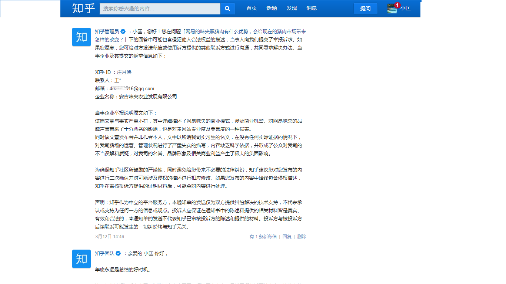
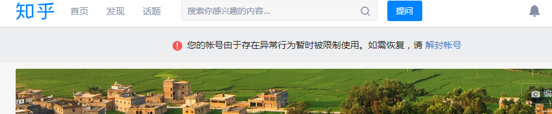
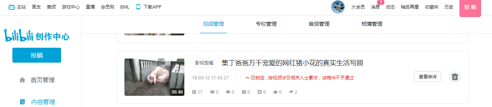
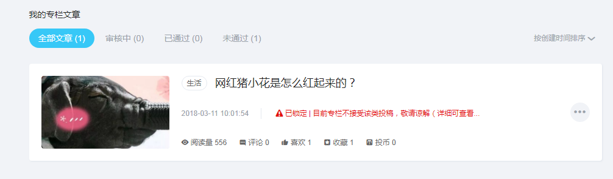

# 公关比董事会尽职

## 调查食堂浪费

2017.4-5月，我首次走进猪场了解到很多真实情况，至8月底离职，中间有3个多月焦躁的窗口期，为了找各种办法解决根本问题，整个人像困在笼子里的野兽一样想突破，很明显网易农业部门走上邪路多年，对眼前公司的境况爱莫能助，找谁都不成，感觉前途无望。工作之余，觉得无聊，试图干点别的。

由于咱是干农业、食品和餐饮相关的行业，比较关注食物浪费问题，发现好多人都会肆意浪费，他们不分年龄、学历、财富和背景。

在网易的四次食物浪费相关经历有非常清晰的记忆，最后一次2017年中，在我离职之前一个月，给网易董事会发邮件，陈述食物浪费问题的严重性以及有必要调查的提议，其中仅仅杭州一地食堂，年浪费食物价值保守估计超过700万人民币，网易董事会也象征性地派了2个代表和我谈话，他们没有否认这个损失数字的说法，然后我也没有获得任何实质进展的反馈结果。

这四次经历和信件原文记录，参考下文：**猪队友众生相- 吃太饱还肆意浪费**

## 给董事的信，猪场年终总结

2017.11月初，我离职后大约2个月，在网易的安吉猪场工作的小李同学也被离职了，我们互相吐槽了一番，从她那里了解到更多一线情况，真是大开眼界。

2017.12月底，结合她描述的情况和遭遇，我决定写点东西，于是作为年终总结发给网易董事会的管理层，原文略作修改，参考下文：**给网易董事监事的信**

由此引发了系列连锁反应 ……

2018.1月初，我收到了负责萨班斯法案404条款内审工作的孟X的信息，说是找我了解猪场的情况，像上次董事会派代表调查食堂浪费问题一样的套路，他照着一个问题清单念了一遍，让我回答并录音，很快就结束了。

问我对现状看法，我的原话大意是：丁老板不适合给味央猪肉代言，除非能说真话，猪小花的市场宣传的策略是错误的，投入那么大，完全是自high，黑猪给老板和网易的名誉带来负面糟糕的影响。

最后提示他，在给董事会信中提到的2位密切接触生产端的同学可以去采访下，他们熟悉农场情况且会说真话的，其他同事的人品我不敢保证。

接着2018新年元旦放假，我出去开会+旅游跨年半个月，等到来年了还没消息，我问反馈情况怎么样了。孟X回答得含糊不清，大意是说自己不专业，不懂养猪业务，要展开独立调查很难，大家又比较忙，都没时间配合。

董事会交代的事情，底下执行层居然推诿说没经验也没时间做？看来整个管理体系已经失控，彻头彻尾的上下一致合伙在胡说八道扯谎。

网易好歹算是国内曾经top5的美资上市的大公司，怎么也有疑似小企业那种草台班子搭建的名义上的董事会呢？这帮草包的高层也不可靠，派出来的董事会的代表像混混一样，没起任何积极作用。

然后，孟X这边就没有然后了……   
但是，然后，这封信引来了一帮前同事，对我忿忿不平地诋毁攻击 ……  
参考系列下文：**猪队友众生相**

当时已经年末了，大家都在忙，包括律师、市场监管部门，于是这事就耽搁下来，等来年再追究吧！

## 网红猪小花的故事，被删帖屏蔽

2018.3.14，直到接近消费者权益保护日，小李同学写了一篇在农场真实见闻的材料，没有再发给网易董事会的那帮草包高管。我们直接发在知乎，bilibili等社交媒体上，网易的公关部门响应神速，不到半天就全网404 删帖屏蔽了。

被网易公关删除的原文保存如下：



董事会风险内控的404法案没用，公关全网404删帖屏蔽反应却特别快，公关比董事会尽职多了。

但就这极短的时间内，还是有许多网友和业内人士看到这篇文章，他们发来信息询问和感叹想不到网易这么有情怀的企业，居然是这个糟糕的状况。

然后，收到法务，公关，市场，生产等部门负责人发来的消息，他们受公司上级公务委派，来找我们谈话 ……  
参考下文：猪队友众生相 - 监事的面子，副总的眼光



这次谈话又刷新了我的三观，他们丝毫没有悔改的意识，而是把掌握越来越多真实情况的人当猪耍弄，继续玩花样炫口技，卑劣无下限，还企图离间我和小李互相信任的关系，越是挑拨我们越是要团结。

## 公关有实力，投诉无反馈

我曾经买了2万多元网易猪相关的产品，离职后还有几千块没消费完，找熟悉的前同事办理退款，他们很不乐意，找各种理由借口拖延了1-2个月，而且出言不逊。

我觉得没必要和猪场的任何猪队友对话浪费时间了，于是投诉到12315，很快就乖乖地给退钱了，只有市场监管部门能让他们老实点，但是在中国目前的市场环境下，更多地约束规范商家的行为是不可能的。

我们把被网易公关删除屏蔽的材料投诉至12315网站，并拨打投诉电话，但是等了很久都没有反馈，确实也印证了市场监管部门的态度。

有朋友说，类似网易猪场这种案例就是典型的“吹牛不犯法”，在中国的司法体系中《广告法》和《消费者权益保护法》无足轻重，惩罚力度不够，坑蒙拐骗造假的案子太多了，政府根本管不过来。

当时很多同事还在这个部门上班，有人和我倾诉来城市工作养家的不容易，听着要人动恻隐之心的样子，和同事的平常私交不多，但关系总体还算不坏，我也不想无辜影响到他们的饭碗吧。

此时已经春暖花开了，我的工作多起来，没太多时间投入到破事上，感觉网易猪场之任重道远还得继续磨。

