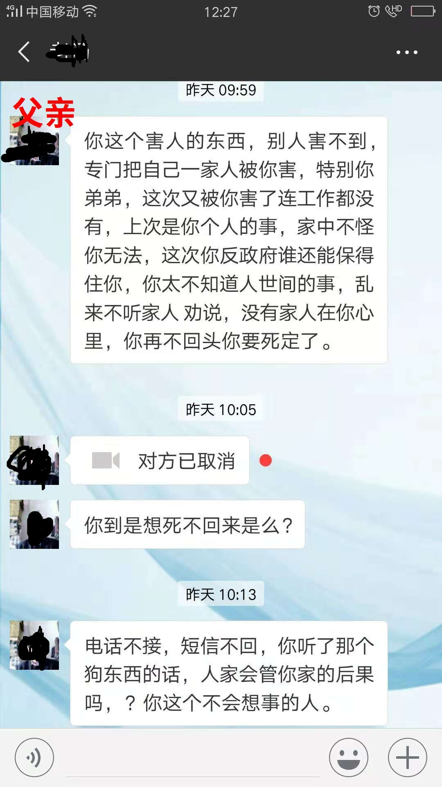
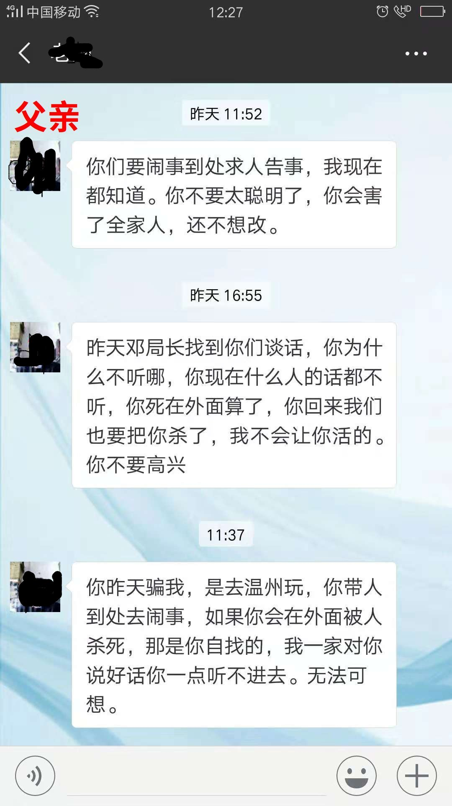
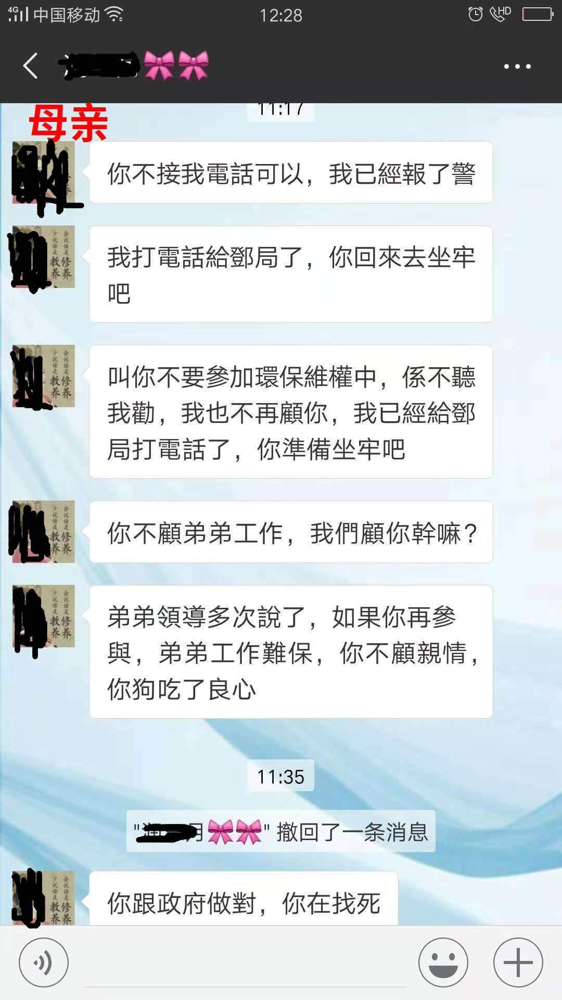

# 父母扬言杀死亲生女儿，因她参加环保志愿者活动

2018.10月国庆假期的一天，江西本地环保组织 - 乐平绿色之光，会长晓英接到求救呼声，让我加入，大家一起想想办法。事发在江西省抚州市金溪县，政府招商引资大量的香精化工行业，美其名曰“华夏香都”，老百姓不堪其恶臭污染，但是消息被封锁，呼声太小出不了江西，有少量的媒体平台报道过。参考[搜狐：**金溪啊金溪，摘了你“华夏香都”的牌子吧！**](http://www.sohu.com/a/252632291_751542)\*\*\*\*

## 环保志愿者被捕

于是部分有勇气的居民，自发组织民间志愿者对污染源进行监测记录，并通过网络传播寻求外界帮助，终于出事了，公安局抓捕了其中一名核心志愿者小齐并拘留10日，一些环保圈的朋友及时对外界发布了这一事件。

民间环保发起人被抓，他触及了谁的利益  
报道: 工业园小张 [https://mp.weixin.qq.com/s/aK2XFEdbOl8wimdLBGQHEQ](https://mp.weixin.qq.com/s/aK2XFEdbOl8wimdLBGQHEQ) （该文已被屏蔽）

志愿者被拘留十天，老百姓呼吁早日放人  
报道: 江萧 生态环境保护前线 [https://mp.weixin.qq.com/s/B\_8LFdLrsmHc22eKnFSGZw](https://mp.weixin.qq.com/s/B_8LFdLrsmHc22eKnFSGZw)

江西金溪环保志愿者被拘，警方：其发表违法言论  
报道: 新浪 [https://news.sina.cn/gn/2018-10-18/detail-ifxeuwws5638946.d.html](https://news.sina.cn/gn/2018-10-18/detail-ifxeuwws5638946.d.html)

我和小齐之前通过电话，了解当地的一些情况进展，在小齐被捕时，他家人和当地环保社团的朋友又第一时间和我们联系，寻求律师咨询，小齐家人说公安局拘捕的时候，在签字的单子上做了手脚，没有充足证据的情况下变成了“认罪伏法”。

混社会的老油条们很擅长这一点，因为他们是专业的，普通人一辈子也没进过看守所，怎么知道合法的办事程序呢？所以家里人眼睁睁看着他关在里面却莫有办法，有现场录音为证。

录音1. 小齐妻子和派出所的民警周某对话 2018-10-17 20-17-45 \[[点击可下载](https://github.com/li-in/blog/raw/gh-pages/blogarch/jinxi/1.amr)\]

争论点是，派出所让小齐家人在“拘留告知书”上签字，然后第二天家人发现这张纸变成了“拘留决定书”，民警周某一再强调就是这张，不怕他们找律师打官司。

录音2. 小齐妻子和公安局的邓副局长对话 2018-10-17 18-44-02 \[[点击可下载](https://github.com/li-in/blog/raw/gh-pages/blogarch/jinxi/2.amr)\]

争论点是，邓副局长说“告知书和决定书的模板格式不一样，内容一样”，而小齐家人发现签字的内容也不一样，明显是被掉包了，让他们认罪伏法。

后来我理解为什么金溪的事情这么难办，他们的工业园污染别说治理了，甚至连事件传播也没什么力度，因民间自发的支持环保的力量过于微弱，同样来自民间阻挠环保的力量更大。

更多老百姓保持沉默中立，资本代表的力量最强，政府配合资本表面上作秀派个领导检查一下，无所作为且背后支持继续违法排放，于是拔河的另一方就赢了。

和同在江西的乐平，以及其他地方污染事件作对比，发现金溪老百姓对维护公共利益的意识差距很大，民间保持沉默中立，甚至阻挠环保的力量有多大呢？这有个典型的案例，如下。

#### 小Z的故事 - 父母扬言杀死亲生女儿，因她参加环保活动

在小齐出事之前，同在环保志愿者数百人群里，另外一个积极的组织者小Z（化名）向我们咨询求助过，当时迫于政府和家人的压力，有很长一段时间躲在外面不敢回家，生意荒废了，也没有收入来源，刚买的房子眼看就要断供，生活无以为继，夜不能寐压力很大。

更崩溃的是父母等家人的打压，通过一位关系较近的朋友，我们看到小Z和家人的通话记录，父母用很恶毒诅咒亲生女儿去死的方式来阻挠她继续参与环保活动，在公安局还没抓小Z的时候，她父母甚至主动给公安局报警，胁迫将她送到监狱。

政府方面给小Z父母压力，将要免除她弟弟在某事业部门的公务员岗位，而她父亲是一名退休的当地检察院的干部，“只计厉害，不问是非”占了上风。

很多时候我们不期望家人支持，让他们保持中立沉默就很好了，而往往碰到了利用所谓的亲情“孝敬”近距离射杀攻击，杀熟这一招特别厉害，小Z就碰上了这样的家庭。

录音3. 绿色之光晓英和小Z的妈妈对话 \[[点击可下载](https://github.com/li-in/blog/raw/gh-pages/blogarch/jinxi/3.amr)\]

老太太咒骂女儿没有“良心”，面对环保圈资深人士的劝慰不为所动，不理解不明白到底谁是在害“家人”，支持环保就是反政府，这种不明是非黑白的观念应该不是自己天然形成的，是整个社会或某些人灌输给他们的。

去年国庆，小Z他们颠沛流离不敢回老家，已经过去一年了，小Z他们偶尔还是会发来不太好的消息。今年国庆，我又看到漂漂亮亮的小Z，在抖音上活蹦乱跳地过节发祝福，我问她是不是金溪的情况变好了，回答否定。

这傻白甜的孩子，伤疤还没好就忘了疼，过去一年谁给她带来的痛哭流涕似乎已经没有关系，忘却也是件好事。

最近一次获悉，她没有再参加环保组织活动，也没有参与类似网络群聊，她坦陈不想折腾了，提这些话题都可能伤害家人，父亲身体不好，母亲肺癌，弟弟还要继续保住工作，自己也要生活。

她不希望我们将该案例和遭遇通过媒体实名报道出去，在大是大非和亲情不能两全时她选择保全后者，遇到这种情况，换做谁都是崩溃的。

我们曾讨论过，如果自己碰到类似的困难，将能够变卖的家产都处理掉，离开不适宜生存的地方，离开那个人群圈子，转移有生力量。

就像打仗一样，这个城攻不下来，力量太微弱就要转移阵地，不要战死在那里，我们痛惜并请求保存这难得的几颗好种苗。

我和他们分析，这件事能做成的几个关键要素： 第一，首要会写能读，做好这一切事件的客观记录； 其二，善用电脑和互联网，将遭遇的事件传播更远； 第三，和外面世界来往，建立外部关系人脉，尤其是刚刚涉足环保圈需要帮助； 第四，掌握英语或至少一门外语很重要，能够牵引来自更远方的发达文明的支持力量。

可是分析发现，当地志愿者核心团队的以上关键能力都很弱甚至根本就没有，正如某些朋友所言“没上过大学，只能留在当地做点小生意，能有什么办法？”，脱离不了和原生家庭及当地社会的依附关系，只能坐地哀叹，求等外援？或慢慢被同化至心灵泯灭……

局限性造就了无奈的现实，任何人（无论其出身，财富，学历，性别，种族），只要还在追求进步努力，就会有大概率摆脱这种依附关系的强引力，尤其在现代社会，种种有利条件下必将有重大突破，这需要付出极大的努力和勇气，核心就是心里面那颗善良美好的种子的基因。

只是现实中往往这种破壳的内在动力还不够大，祝福还有一些理想尚存的朋友们！  

这让我想起人类社会和自然生态何其相似

自然界的普遍规律，  
种子落在一片烂地方只能长成歪瓜裂枣，  
一代一代遗传下来便是歪瓜裂枣，  
这片土地若没有改进，甚至腐烂绝种消失。  

若她是颗善良美好的种子，  
努力长出滑翔翼或颗粒饱满一些，  
就可以乘着风或鸟作为信使的翅膀，  
飞到另外一片肥沃宜居的土地，  
等待时间和适合的土壤温床，  
在出生地以外的土地上，  
生根发芽长成茁壮的大树。  
有足够抗风暴的力量，  
结出足够多善良美好的种子，  
再乘着风或鸟作为信使的翅膀，  
将更多善良美好的种子再吹回来，  
只要有足够多的种子，  
就可以埋葬这片烂地方，  
让自然的力量消化包裹着的发臭污染物，  
世界能重归于好，成为美丽的天堂。

所谓“人间正道是沧桑”，“好事难做，好人难当”，这一系列事件经历是人生最好的阐释。

我经常关注的自媒体鹿鸣君以职业记者和媒体人的视角记录了环保志愿者的故事，我们认识一些共同的朋友，构成社会中坚力量不能塌，我的信念是要努力支持他们。

为人抱薪者，赤手空拳  
回归荒野：“中间我靠卖红枣，卖柿饼，撑下来了。” [https://mp.weixin.qq.com/s/uBY\_oV1HuU2o1maVe4ct6g](https://mp.weixin.qq.com/s/uBY_oV1HuU2o1maVe4ct6g)

