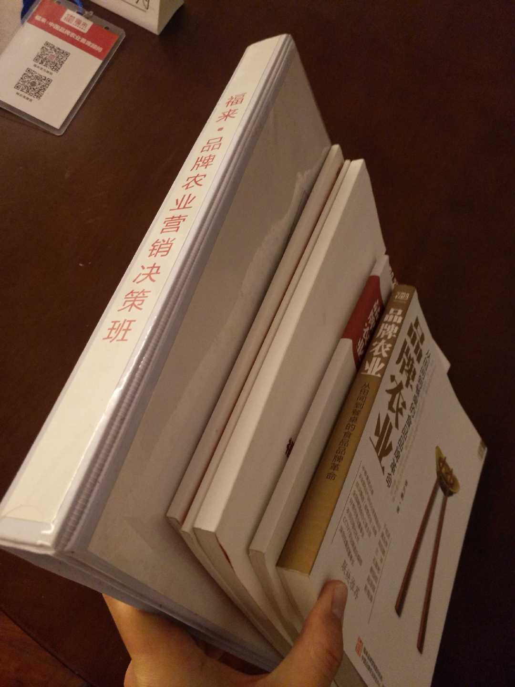

# 品牌农业首席顾问 FL.

之后，我给某家农业公司做电商培训，甲方老板让我参谋一下营销工作，把我约到北京鸟巢附近的五洲皇冠酒店，说是此地有一家最牛的品牌营销公司。

题外话，多年前我经常路过鸟巢周边的酒店，数次被五洲门口的大妈拍车窗，问“按摩……”之类的，当时我是刚工作不久的愣头青，听不懂社会人的暗语觉得莫名其妙，司机说那是皮条客老鸨，看我们坐的车还不错，好像很有钱的样子，想套我们上钩，因此对这个地方印象较深刻。

在此“特殊服务”之地，我们参加了一场据称2天2万元培训费的品牌农业营销决策班，主办方就是号称史上最牛的**品牌农业首席顾问FL.**，这是他们的官网 [http://www.flyteam.com/Func.html](http://www.flyteam.com/Func.html)。近距离的接触和了解也让我对农业食品的广告和营销行业有一些不同于以往的深度洞察：

* 培训的关键是搞定甲方老板就能拿到钱，所以作为乙方的FL始终围着甲方老板转，而不问问他底下做运营和市场人的更多想法建议。FL的品牌顾问就像江湖老千一样善于沟通，而在乙方做美术文案等重要的技术类岗位工种的人，也像甲方做市场和运营的人同属于底下无足轻重的，他们不可能像4A广告公司创意部门那样受到尊重，并凭作品去戛纳拿“创意奥斯卡”，因为缺乏核心思想和精神灵魂的创意土壤，即使有才华也很难在这样的环境下出产高品质的作品；
* FL吹牛把自己包装成很懂卖东西的专家样子，所谓的品牌营销的重点是“讲”品牌设计，并没有更重要的“做”营销推广，花费上百万的顾问费只能收到一个未经验证的品牌概念和产品包装，还得甲方另外组建运营团队，额外花费去跑市场开拓销售渠道；
* 甲方农业公司的产品是几元钱一斤的粮油类初级农产品，得卖多少米才能挣回上百万的广告投入？如果挖3个在阿里或京东3年经验的运营，让他们996干一整年，够包线上线下全套营销。如果给点股权之类的大饼激励，再招几个小弟组成团队干2年，目标是不仅仅交付一个产品包装概念，而是实打实地把东西卖出去，他们能养活自己，2年后就不需要那么多前期投入，开始盈亏平衡就算成功完成第一步；
* 如果品牌营销设计外包给刚毕业20来岁的年轻人，只要充分信任并放权做就好，他们更在乎的不是多少钱，而是好的设计作品，可能不到三分之一成本就能搞定品牌顾问动辄要价百万的广告包装设计费，当然年轻人的很多套路都不一样，甚至钱不会花在线下常规的产品包装和推广上，传统的品牌顾问根本不会这些新玩法，其性价比不可同日而语。
* 传统的平面广告设计公司本质上不属于完全的营销顾问，因为他们只能做传统的纸媒、广播、电视广告和产品外包装，做不了互联网线上的整合营销，更搞不定依赖于IT和计算机科技的流媒体和数据营销。而现在的营销是不分渠道和形式的，能做出更大影响力的品牌也更依赖于线上工作。将品牌，市场，广告，包装混为一谈，好像这些活儿是一回事，想想以下这些细分的技术工种都通了吗 ？
  * 市场：用户画像，数据分析和挖掘，市场调研和竞品分析，行业和产品研究，客户忠诚度研究等；
  * 广告：数字营销，精准投放，广告监测，广告效果评估，舆情分析和监测等；
  * 包装：新兴的材料科学，环保材料，无菌消毒，无防腐剂保鲜等；
  * 品牌：品牌概念，包装设计，品牌价值评估等；

以我们做网络平台产品为例，现代的品牌营销和产品设计中的GUI&lt; UI&lt; UX 进阶顺序排列如下：

* GUI美术设计，负责图形界面视觉，俗称美工；
* UI界面设计，负责GUI元素设计，以及所有的视觉设计规范和标准，是美工组的领导，而美工仅仅是设计的一部分；
* UX人机交互设计，UED用户体验设计，懂心理学、人体工程学、计算机，市场营销等学科，是整个设计组的灵魂大脑；
* 还有产品经理，研发工程师，及其负责的MVP原型验证，可用性测试，互动娱乐设计，用户研究，产品创新和生命周期，精益管理等等。一个基础团队大约有10号人，中大型规模可能得数十至上百人，还不包括一些外包出去的细分专业工作；

而品牌营销仅仅是属于整个产业链中的部分环节，需要公关，新媒体，供应链，客户关系管理CRM等等专业工作的密切配合，也越来越依赖于IT网络技术支持，至少从整个培训过程和材料中观察，他们并未提及上述这些关键技术工种，我们听到最多的概念和实操都是与“广告、包装”有关。

与年轻的新兴网络品牌营销相比，类似FL的很地道的传统广告公司毫无竞争力，他们无法连通企业的整个产业链体系，可能都没听说过UX之类的新名词，基本只会做常规的平面广告，也就是国内传统概念的美工和文案，如果认为这俩工种是整个设计和品牌的全部，那就是非常落伍了。农业食品等比较基础落后的行业当前还有大量的工作需要外包，他们若在其他行业根本不太有机会，随着时代发展进步，广告业10A+水平甚至都不够做农民的生意。

FL为培训活动发了一堆包装厚实装帧精美的文件袋，看起来很大牌的样子，一堆图书杂志却没有出版号（据说现在已经出版了），其中引用了很多商业图片，没有注明来源，也不可能低成本获得授权使用，这是明目张胆的盗用，首席品牌顾问怎么犯这样低级的错误呢？

如今在机场火车站的灯箱广告或航空杂志上，随处可见类似的营销顾问的经典造型和招牌动作：两手交叉抱胸，无领中式服装，很有点要继承中华文化道统的味道。FL团队也是如此，如果每人再配把保温杯加枸杞，带佛珠，留胡子，光头或火箭头，社会大哥的风范形象地位就圆满奠定了。

下一篇文章会介绍该公司的董事长。

