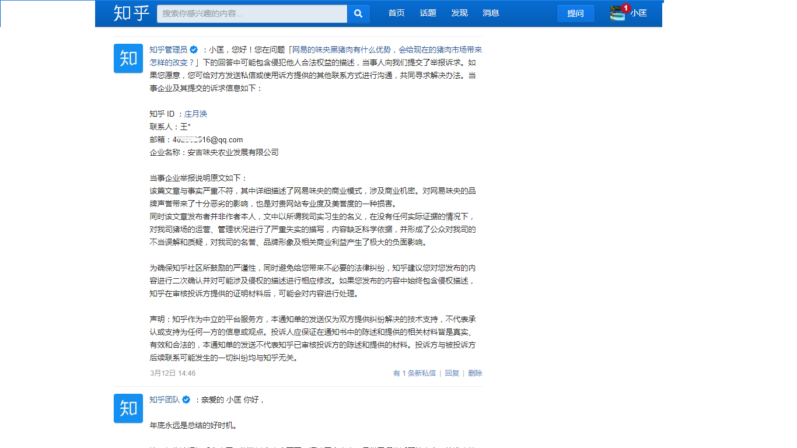
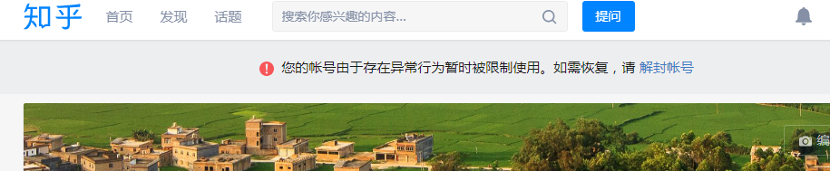
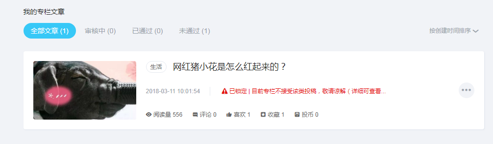

# 公关比董事会尽职

## 工作太无聊，调查食堂浪费

2017.4-5月我首次走进猪场了解真实情况，至8月底离职，有3个多月焦躁的窗口期，整个人像困在笼子里的野兽一样想突破，感觉前途无望，对眼前公司的境况爱莫能助，找谁都不成，我能干什么呢？把手头工作干完之余，觉得太无聊，试图干点别的。

由于咱是干农业、食品和餐饮相关的行业，比较关注食物浪费问题，发现好多人都会肆意浪费，他们不分年龄、学历、财富和背景。

在网易的四次食物浪费相关经历有非常清晰的记忆，最后一次2017年中，在我离职之前不到一个月，给网易董事会发邮件，陈述食物浪费问题的严重性以及有必要调查的提议，其中仅仅杭州一地食堂，年浪费食物价值保守估计超过700万人民币，网易董事会也象征性地派了2个人过来聊一下，他们没有否认这个损失数字的说法，然后我也没有获得任何实质进展的反馈结果。

这四次经历和信件原文记录在另一篇文章中： 



## 给网易董事监事的信，猪场年终总结

2017.11，我离职后大约2个月，在安吉味央猪场工作的小李同学也被离职了，我们互相吐槽了一番，从她那里了解到更多一线情况，真是开了天眼。

我于2016.11创建网易动物福利公开课字幕组，她成为志愿者中最得力干将，因为出色的能力表现，通过网易HR沈X和味央总经理N总招聘进来工作，我算是小李同学的引路人，给网易做了半年志愿者，进来工作4个月就被辞退了，实在想不到。

结合她描述的情况和遭遇，我决定写点东西，于是2017.12月底，作为年终总结发出去了，原文略作修改，记录在另一篇文章中：



很快就收到了负责萨班斯法案404条款内审工作的孟X的信息，说是找我调查了解猪场的情况，像上次董事会派代表调查食堂浪费问题一样的套路，他照着一个问题清单念了一遍，让我回答并录音，很快就结束了。

问我对现状看法，我的原话大意是：丁老板不适合给味央代言，除非能说真话，猪小花的市场宣传的策略是错误的，投入那么大，完全是自high，黑猪给老板和网易的名誉带来负面糟糕的影响。

最后提示他，在给董事会信中提到的2位密切接触生产端的同学可以去采访下，他们熟悉农场情况且会说真话的，其他人的品性我不清楚。

紧接着2018新年元旦放假，我也出去开会+旅游了，跨年回来问情况怎么样了。孟X说自己不专业，要展开独立调查很难，大家都没时间配合。（董事会交代的事情，底下执行层也没时间做？这要么就是整个管理体系失控，要么就是彻头彻尾的胡说八道扯谎）

然后，孟X这边就没有然后了，但是，猪场生产部门那边有然后 ……

### 小李同学这边……

_很快猪场负责生产部的周X等人给小李同学一天来10多通电话，据说给董事会的信转到总经理和农场，因为涉及较多生产部门的问题，他们可能要受到上级处罚，周X很恼火沮丧地告诉小李：“小匡离开公司就想出口气，不要被这种人利用了，拿着高薪啥事也不负责，不符合公司价值观，就该趁早走 …… ”。_

_小李保存了和周X通话录音并转述给我，当时我很生气就没有听录音，感觉周X这些猪队友的脑路受损，他分不清黑白是非对错就来诋毁了，也没搞清楚我在为谁争取权益和发展，这些录音一直留存着，直至近2年后的今天我才打开仔细听一遍，愈发觉得不可思议。_

_周X是小李同学在猪场的上级生产主管，小李被HR沈X逼迫在极短时间内离职也是经过周X签字的，憨厚又聪明的小李同学的离职信是这样写的：_

> _本人进入味央后发现实际情况与宣传不符，所做努力得不到反馈 ……_

_为了尽快赶走小李，周X还真敢签字，签了就意味着他承认了我们发布在网络里的这些问题真实不虚，另有文章讲述这些猪队友的奇葩操作，真让人开眼界。_

\_\_

看来董事会这帮高层也不可靠，派出来的董事会的代表像混混一样，没起任何积极作用，反而引来了底下一帮忿忿不平的诋毁攻击的猪队友。网易好歹算是国内曾经top5的美资上市的大公司，怎么也有疑似小企业那种草台班子搭建的名义上的董事会呢？

我和小李都没闲着，有自己手头上的其他工作，没时间投入到这件事上继续追问，年末了大家确实都在忙，包括律师、工商部门。

## 3.15网红猪小花的故事，被404删帖屏蔽

一直到接近2018.3.15消费者权益保护日，小李同学写了一篇在农场真实见闻的自述，我发在知乎，bilibili等社交媒体上，不到半日就被全网404 删帖屏蔽。

小李同学被404的原文现保存在这里：



董事会风险内控的404法案没用，公关全网404删帖屏蔽反应却特别快，公关比董事会尽职多了。

但就这极短的时间内，还是有许多网友和业内人士看到这篇文章，许多人发来信息询问和感叹。然后，大半年没联系过的几个前同事，打来电话嘘寒问暖，教导我如何做人的道理，让我撤了稿子，否则就如何如何对我不利，他们话风一转语气厉害了起来，真是鸭子死了，嘴还硬。

## 法务的面子和5分钟能力，副总的非正常好眼光

期间，网易资深法务兼味央猪场监事的董X，就是之前董事会派来调查食堂浪费没有回音的那位代表，他多次联系我和小李同学，我和法务很少有日常工作交集，彼此不算熟悉，为了找到见面理由，他多次反复说“给我个面子”，请我们喝茶，一定要当面拜访一下，语气显得谦卑，很清楚他是来公关的，我也想听一下他们接下来是怎么打算。

2018.3月底，等到我有空闲，约了法务董X碰面，随行一共3人，一位负责市场部的女同事，还有味央猪场的副总张J，张J说“小李同学刚毕业，就想坐上我的职位，在农场没有进过猪舍，不懂养猪，那个文章乱写的，很多错误，不要听信她的话 …… ”。

张J的说辞和周X的很像，他们分别告诉我和小李同学，“不要相信他/她，不是什么好鸟，会把你带偏的，后果自负 ……”。

谈话的更多细节在下面这篇文章里详述：



这次谈话又刷新了我的三观，他们丝毫没有悔改的意识，而是把掌握越来越多真实情况的人当猪耍弄，继续玩花样炫口技，卑劣无下限，还企图离间我和小李的互相信任的关系，越是挑拨我们越是要抱团盘它。

## 投诉无反馈

到了这个阶段，我觉得没必要和猪场来的任何猪队友对话浪费时间了，我们把这个案子投诉至12315网站，并拨打投诉电话，但是等了很久都没有反馈，由于还有其他重要工作，我们当时没顾得上继续折腾。

期间有个朋友介绍律师说，类似网易猪场这种案例“就是吹牛不犯法”，《广告法》和《消费者权益保护法》无足轻重，惩罚力度不够，花了钱公诉的胜算不大。

也尝试过联系媒体，但是朋友介绍的几个记者一听，觉得我们直接证据不充分，成为热点的把握不大，网易的公关力量他们是知道的，反而有可能被猪场倒打一耙，于是这条路也走不通。

当时很多兄弟们还在这个部门上班，不少人曾倾诉来城市工作养家的不容易，我是有动过恻隐之心的，虽然同事们平常私交不多，但关系总体还算不坏，我不能影响他们的饭碗，甚至离开之后没有和他们任何人再主动联系过，他们也极少人和我再联系（这极少的联系一般也是劝阻不要发布任何有损于猪小花形象的材料）。

此外，如果充分暴露该事件，我顾忌过自己也会沾上污水，大家都知道我是个刺儿头，导致“以后很难在圈子里混了”，而且我是特别懒于写文字的，更不喜欢翻旧账揭伤疤。

于是这事就耽搁下来，一年多来没有在网上公开说过什么，如果有人感兴趣问，我们就直接发当时备份的文件。  

## 猪队友，平庸之恶，乌合之众

一直到最近，再次触动我的关键因子是2019.11.24号朋友圈热传的一篇文章：[**网易裁员，让保安把身患绝症的我赶出公司。我在网易亲身经历的噩梦！逼迫、算计、监视、陷害、威胁和暴力裁员手段。**](https://mp.weixin.qq.com/s/FW7uR5t6UMMxgkCcAvk-)\*\*\*\*

转发到朋友圈后，很快前猪场同事王x峰和我联系，这颗同样被裁员割掉的大韭菜，拐弯抹角地歌颂起镰刀来，劝阻我不要转发以上受害人的文章，并教导我要懂得对公司国家社会感恩之情的人生大道理，这些恬不知耻的话把我激怒了。

已经过去2年的网易猪场的陈年陋事，在脑子一直如阴沉乌云般氤氲不散，这些事件犹如闪电一样突然击发雷暴雨倾泻而下，我被震醒。

由于都是些庸庸碌碌平凡普通的小人物，平常造作的也是不明显的小恶，关键时刻会经常“拖队伍后腿、出卖队友、坑害队友”，这符合网络上“猪队友”的定义，那就写点猪队友的故事。下一个系列：猪队友系列。

