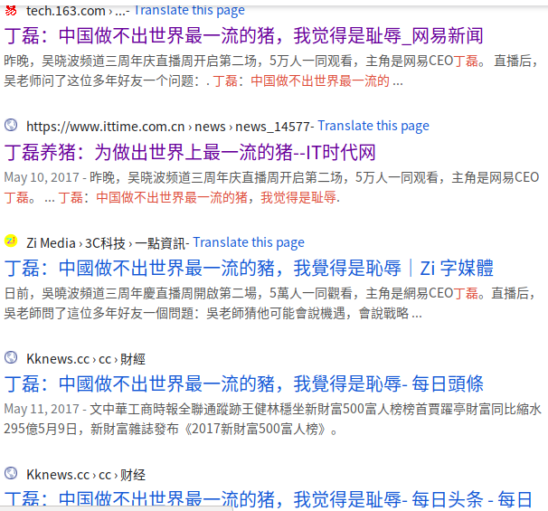
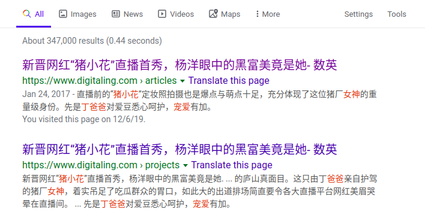

# 看不清女神猪小花的真相

## 现象级的网红猪

从2009年到现在，互联网上关于丁磊养猪的各种热文每年都会冒出来，从未断过，网易官媒有时放出一些消息公布进展，丁磊也经常在媒体上表决心确实想把这个农业项目做好。

但网易猪拖延了7年才上市，吊足了吃瓜群众的胃口，但公众还是缺乏对网易猪的了解，就我所在的杭州互联网圈子，知道网易味央这个品牌的人所占比例不高，而看丁磊养猪笑话的人却不少，网络传言“猪没养出来，新闻倒挺多”的现象，在业界是值得探究的。

**参考新闻：**

* [历时7年，丁磊养的猪终于开卖了](https://www.pearvideo.com/video_1011980)
* 丁磊：中国做不出世界最一流的猪，我觉得是耻辱 （[~~原文链接已失效~~](http://tech.163.com/17/0510/14/CK357VDU00097U7R.html)，百度也彻底找不到，可能后来连网易自己都觉得不合适，于是主动删贴了。不过还可以找到[当时的快照](https://web.archive.org/web/20180331101633/http://tech.163.com/17/0510/14/CK357VDU00097U7R.html)）
* [新晋网红“猪小花”直播首秀，杨洋眼中的黑富美竟是她 ](https://www.digitaling.com/articles/34448.html)

本人作为项目中的亲历者，已于2017年下半年离开，但时不时还接到各方询问，有意向投资养殖业的老板问：“网易猪养的到底咋样？”，想吃肉又不差钱的朋友也有问“值不值得买？”。

私下里零零碎碎讲费时间，把过往经历的一些笔记整理下，集中分享，从源头说起 ……

## 夹着尾巴做人

2015年末，我接到猎头的“生鲜农产品电商”机会的邀约，介绍了网易某部门副总裁L总，聊了几次感觉都不错，看我对网易养猪的兴趣大，继而把我转介绍给了网易味央总经理N总，也就是传说中养猪的网易农业事业部，和农业部门N总也聊得不错，讲到自我评价，我说自己啥都还好，就是情商比较低，很多时候说话办事很直接（这为后面的事件直接埋雷了）。

2016.1月初入职，正式开始了帮助网易养猪的生涯。

中间一个小插曲，入职第一天，介绍人L总引着我进办公室参观，他第一句话说“在这里要夹着尾巴做人，要有敬畏心”，我心里咯噔一下，敬畏心我听得懂，但是“夹着尾巴”是几个意思？难道发生了什么事？上贼船了？当时没来得及追问，既然来了，待一段时间不就知道了么。

然后没几个月，L总部门的生鲜电商项目组兼并到农业部门了，好多同事过来，人事结构和业务混乱。再过不久，L总所在的部门整体被裁掉，他离开了网易转投另外一家土豪金多的公司，此后我们只见过一次，断了联系。

## 内热外冷，因为猪小花，我受到歧视

第一年，一切庸庸碌碌平安无奇，我有多个头衔“资深农业专员，平台运营专家，产品经理”，因为在杭州的办公室做的事情很多很杂，类似综合项目管理和平台规则等琐碎事务相关，由于农场封闭不对外开放参观，内部员工包括农业事业部的人，也没几个人去过，网易猪场给公众一直都是神秘的，挺有新鲜感。

看媒体上各种报道宣传，这是一个高大上充满黑科技的项目，网易在互联网界获取猪场的尊号，不单网友很感兴趣，经常走在园区有其他部门同事看到我们工牌好奇地问“是不是养猪的？怎么去农场玩？”，然后引来一阵哄堂大笑，那感觉全世界的人对我们都有好感，这简直是最好的职业，似乎整个科技园区的姑娘都想要嫁给养猪的汉子 ……

偶尔出去参加一些活动，只有走出去才知道自己是什么水平。

### 展会论坛

每年都有几次畜牧业展会论坛，刚开始遇到同行我都很高兴上前打招呼，对方接到名片一瞧，有不少人的反应迟钝或表情凝固，后来了解到，人家对网易有意见，说：“**丁磊公开在网上攻击我们，全中国别人家的猪都是劣质的，就网易是最好的，而实际网易也不咋地，只是有钱，有互联网媒体资源，敢于做夸张的广告……** ”。 我当时想这纯属污蔑造谣抹黑，“同行冤家”不团结，见不得人家好，羡慕嫉妒恨吧。

### 大学

春招到国内top3的某农业大学去招聘，一位业界知名的学者先说欢迎欢迎，面对一大群学生画风一转：**你们老板，很多说法不靠谱，我们多年前就打过交道，有学生去过网易农场，和网上报道不一样，不是那么回事……** “，这一回让我很尴尬，我没去过农场，怎么知道它咋回事啊？我开始怀疑人生了。

然后应邀去浙江大学参加活动，我是其中一个发言嘉宾，一些非农业专业的学生也在现场的交流中，拿着话筒对全场百十来号人公开说“**网易养猪就是个噱头，到底怎么样呢，我知道的 ……**”，现在这些小同学很厉害，好像啥都知道，谁都敢公开怼了，这再次加深了我的焦虑感。

在公司里不出门，我们受到热情相待，志得意满；出去了被人泼冷水，因为这头猪，我受到了侧目歧视，才知道得罪不少人。

内热外冷，冰火两重天 ！

## 公众不了解网易猪，内部人也不知情，为什么？

老板可能无心一句话，我们就得替他背黑锅，在江湖上难做人，还自以为高大上的科技互联网公司很牛呢，名声这么坏却没有自知之明，我们是不了解外面世界的井底之蛙，其实人家早就知道状况了。但我一个不知情的内部人很无辜，真不知道发生了什么，一切无法证明吗？

好多次试探着找N总问？不可能，明摆着谁要说味央的不好，他立马跳起来反驳，你得天天夸，鼓励他才行。找其他员工问，一个个都对“老板说了我们是最好的”深信不疑，要么说他们也没有去过农场不知情，然后我说服自己：谁家没毛病？谁也不是完美的，只要还在不断努力改进就是好的 …… 。

早出晚归，周末加班，热情服务，工作卖力自不必说，还要舍得在自己的产品上花钱，其实我不怎么喜欢吃肉，为了支持本部门事业，买买买，一年时间我前后几次订了2万元味央猪产品，包括礼品卡和2017年3月的众筹，公司有1万人，即使一半的人像我这样买，众筹早就突破1个亿了，官方公布的众筹金额不到2千万，绝大部分味央粉丝还是外部的。

我就这德行，经常看到网上谁文章或视频做得好，下面有二维码的就点赞打赏，有时钱包里只有10块钱，也要拿一半出来分。你要相信它是好的，直接拿现金支持，别光嘴上喊好好好，却没有实际行动。

进入该部门将近1年，我有自己的独立思考和看法，不再迷信官方媒体（近在咫尺的身边人）的话，想知道老板说的话有没有谱？网易猪到底用不用药？养了多少头？对于我这个内部人，这些都是个谜……

无论是外部公众，还是内部的人，都不知道网易猪是怎么养的，我特别想知道为什么？  

### 见到“真实的”猪场

我有很多次在大小场合提议，把各种团建会议，周末户外活动放到农场去，我就好这口，但是始终没有获得批准，N总答复说还没准备好，终于熬到来年接近猪场的机会了:

#### **猪场直播**

2017年3月28日网易猪场直播-丁磊对话吴晓波（第70-90分钟）[http://c.m.163.com/news/l/120854.html?w=7](http://c.m.163.com/news/l/120854.html?w=7)

在直播中丁磊说，中国每年6亿头猪，那么多猪场这么多年，没有哪一家敢直播的，里面有很多见不得人的事，养猪的人不吃猪肉，网易在行业首创敢于直播的猪场，他还鼓励所有行业都能直播。

就冲着老板的7年磨一剑的精神，很钦佩丁磊作为公众人物仗义执言，揭露行业黑幕，担负企业社会责任，环境责任，并且他非常明确表示，网易已经做到世界数一数二的猪场，包括动物福利，能经受全世界的标准检验，最高效率，最低成本，最环保。

直播那天我在忙别的，没有盯着线上实况，活动结束后我反复看了两遍录像，**发现一些疑点：**

* **网易猪场官方仅仅直播过这一次，并没有长期在农场安装摄像头做实时直播，这能算什么直播公开呢？**如果直播完了第二天，他就把农场的很多日常真实的场景改掉呢？当时我还问了N总，网易青果摄像头我家里也安装啊，农场装上也不贵，但是他没回应我。 而且只给大家看局部比较容易打理的搞得很干净的“育肥猪”区域，能给看看核心的“妊娠母猪”区吗？
* **中国肯定不止这一家猪场或农业公司做了直播，其他养殖公司早就有做过直播的，因为没有网易的名气和媒体渠道，观众没有网易的多，怎么可以说网易首家？** 显然网易按照惯用的娱乐业手法操作实业生产，花姑娘打扮一下扭一扭，因此后来猪场直播遭人质疑为“噱头作秀”也是合理的。
* **最高效，最低成本，最环保，单就这几个“最”就已经违反广告法了吧。**丁磊光顾着和吴晓波对着网友吹牛了，没有意识到自己几个夸张的“最”是不可能的。

听大佬谈话，也要带着自己的脑子，不能被他们忽悠带偏就信了，作为一名置身事内的员工更应该理性客观。

所以当时我替老板的表达方式着急，农业事业部那么多工作人员在旁边，而且他们之前有很多交流，7-8年了，说话能成熟靠谱一点吗？怎么就没人给纠正一下呢？

这次直播同时的众筹金额线上公布的数字再创新高，身边大多数同事都在欣喜狂欢，好像眼看着就要公司上市股价疯涨大家都跟着分钱一样，每个人都庆幸自己加入一个好公司有前景的好项目，冲上人生巅峰迎娶白富美指日可待似的。

大部分不在一线工作的员工和消费者都是又傻又天真，以为老板说的都对，都相信老板的实力能做到，没有人会怀疑，毕竟他是中国排名前五的富豪，网络大V。

那天下班后，我一个人坐在僻静的靠窗工位里，冷眼感受这热闹的场景，集体狂欢背后的种种隐忧，不靠谱，不可证实，无法信服。

我依然不知道为什么……

#### 文章

同时，看到同事写出“人不如猪”等系列网红猪小花的推文后，感觉那种借着网易丁磊名号的狐假虎威，自我吹嘘浮夸很打脸，全公司的人都在转发文章，我就没转，还对市场部做设计和文案的同事数次提出过公开质疑，当然遭遇了人家的白眼。

网易味央的部分公众号文章:

* [别不信，你的人生也许不如这头猪](https://mp.weixin.qq.com/s?__biz=MzI4MDE2MjIxMg==&mid=2650755972&idx=1&sn=a7d175a2a62ed7767750e1665992c608&chksm=f3b7494fc4c0c059c3b9543843192618eee26c60d0536253517b3e56d3feada138200c40e42d&mpshare=1&scene=1&srcid=0227FC4EUIMGzu87SXqNPpvg#rd)
* [领导：这有一份现象级猪肉的年终总结等待您的检阅](https://mp.weixin.qq.com/s?__biz=MzI4MDE2MjIxMg==&mid=2650755792&idx=1&sn=59a35d72681dde3e3428c7de3b6af022&chksm=f3b7481bc4c0c10d17250f20541cd1e0ade2ff148884f525de5872455f124aa26b8aa6e5307b&mpshare=1&scene=1&srcid=0227ehapvVU4qBFjt0o4mS3b#rd)
* [网易养猪7年的光荣与梦想都在这了](https://zhuanlan.zhihu.com/p/25747948)

得罪人在任何地方都很难混下去的，这是常识，如果遇到这种情况不能改进，工作于我无多少价值，还能混多久呢，我非常明确这一点，轻言放弃很容易，但不忍前功尽弃。

入职第一天L总作为长者淳淳善导“夹着尾巴做人”，进化成人了，没有尾巴，怎么夹？尾巴作用是什么呢？但总有人会长尾巴，尾巴是用来揪的（1年后悟出来）。

继续盯着发问， 等待深入的时机来了 ……

### 维修设备

第二件事发生在2017年4-5月份，因为进口的自动饲喂设备的故障问题积累，久而未决，农场那边据说顶不住了，从公司找人去搞了很久也搞不好，然后让我接上荷兰厂商的工程师去农场检修设备，两天扫荡故障写了一份30多个关键bug的报告，对比3月份直播，这才发现原来如此，外界传言不虚，只是我们内部员工一直都不了解猪场，更确信网易官媒有虚假宣传误导。

### 水处理

这第三件事，让我严重质疑农业事业部及猪场生产负责人的职业能力和素质。

2017.6月份接到环保工程师水处理数据（我和他们来往邮件核实了2-3次，当时他们发送的数据应该没有错），根据各种国标（国家畜牧业污染排放标准和饮用水标准）对比发现，国标的检测工艺方法与味央可能不同，而且味央多个关键指标空缺或低于国标。

因此味央还不能说其处理后的水质达到饮用水标准，甚至其宣称的符合《污水综合排放标准 GB 8978-1996 》一，二类水质都存有疑问的。

我把对比结果以邮件“网易味央安吉养殖场水处理情况与国标对比”，发给N总和相关负责人看，并当面询问，他们始终没有回应。这需要相关水处理机构给出中立的客观专业报告，而不是他们单方面宣称如何。

## 

基本上到这个时候，我对味央项目和团队已经丧失信心，8月底通过公司邮件组找到董事会一个高级副总裁K总，和农业事业部总经理属于同一级别或更高，我试图最后一次在内部和管理层聊聊，大概率是差不多该撤了。

下一篇将介绍与副总裁通信与辞职。

