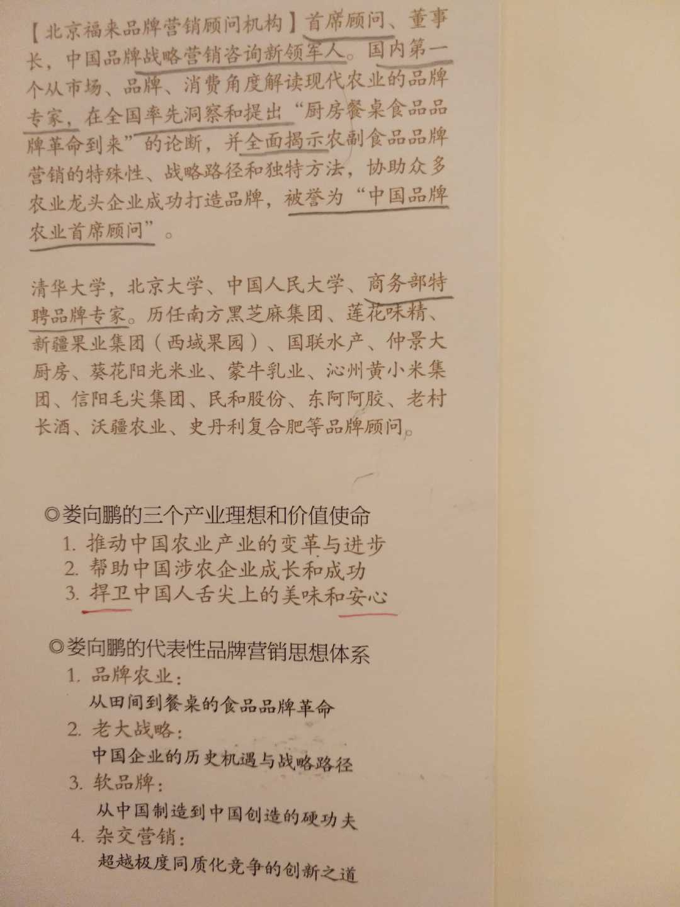
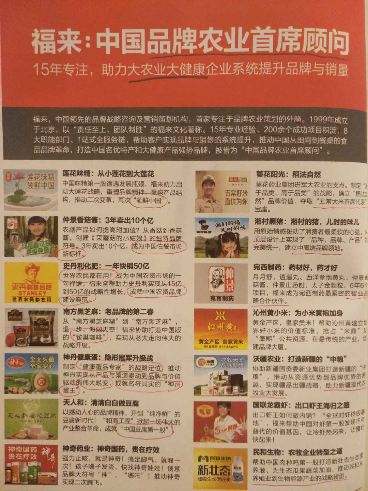

# 董事长的经典造型和著作

FL的董事长还是个文化人，著作颇丰，参考下面两张图。

**图一：**  

归纳起来，FL董事长的介绍：

> * 品牌战略营销咨询新领军人物
> * ××× 国内第一
> * 品牌农业第一人
> * 中国品牌农业首席顾问
> * ××× 董事长/ 总裁
> * 产业理想和价值使命：捍卫中国人舌尖上的美味和安心

被谁誉为首席顾问？给自己脸上贴金戴高帽子，被自己誉为吗？手下没几个兵，也好意思自称董事长和CEO？

这一堆无不落空的虚名头衔与传销微商教主们很像，类似案例特别多且离谱，推荐呦呦鹿鸣的一篇文章 “**骗子吹又生：让全球75亿人对中国人磕头跪拜**” [https://tech.ifeng.com/c/7sFtk6yrZpt](https://tech.ifeng.com/c/7sFtk6yrZpt)

**图二：**

“美味”需要你捍卫吗？每个吃货都会自己投票去捍卫。你怎么帮助公众捍卫的？“捍卫安心（安全）”确实是关键，但通篇没有一处讲如何帮助企业做到食品安全的，反而教导企业在品牌宣传上怎么虚夸造假很有一套，许多的废话假话空话套话，还有一堆华而不实的“成功项目案例”。

* 这些所谓的“标杆，领导者，第一，老大，首席，中高端，伟大”的品牌，许多人根本就没听说过，他们都是早年已经过气的区域小品牌，市场上也几乎见不到，经过FL的品牌顾问包装就成了行业第一？第一能自封吗？
* 史丹利化肥，世界农民都在用？我混迹在农业圈也有10年了，所接触的国内外朋友怎么都没用过史丹利，甚至都没听说过？难道我们不是这个世界的？
* 亮出一些名人合影，好像人家为他站台做权威评荐，可这些人是权威吗？我参加过大使馆和奥运活动，若乘机和上百个国家领导人与明星合影，是不是也可以拿出来吹牛证明自己很厉害？真悔不当初，没有留下影像佐证；
* 搞了一堆各种大学讲课照片，衬托学术水平的高度，实际上是租用了大学某一个教室的活动。人民大会堂和故宫也可以商业开放搞活动，不了解这些事的还以为在这些地方参加活动的有多牛X，这不是把企业家当做没长见识的农民一样地欺骗吗？

歪点子非常多，许多未成年人都懂得。如果想显得更高端，花万把块还可以上纽约时代广场大广告牌呢。

> 在微博上随便一搜，就能发现很多微商宣称登上了时代广场，通常他们会用下面这样非常“城乡结合部”的口气：

> > “世界的中心在美国，美国的中心在纽约，纽约的中心在曼哈顿今天XXX登上曼哈顿时代广场！！！在这个每小时100万流量、每年数十亿人流的“世界的十字路口”XXX代表XXX向全世界展现风采，向全世界证明中国微商！ ”
>
> 来源： [http://www.sohu.com/a/229161064\_174744](http://www.sohu.com/a/229161064_174744)

还有找退休的名人合影的，例如找退役的美国总统奥巴马出席活动演讲，找动物世界知名播音员赵老师写福字和发祝福视频等等，许多土豪老板特喜欢做这个，花钱少效果好：[https://mp.weixin.qq.com/s/FyAZFa0gEIV2KH5Sixtwzg](https://mp.weixin.qq.com/s/FyAZFa0gEIV2KH5Sixtwzg)

FL所有的培训材料和成功项目案例中，惯用那几句几十年生生不息的脑残广告词：

> * ××× 行业领导者
> * 首席 ×××
> * ××× 产业化倡导者
> * ××× 发起人
> * ××× 大农业
> * ××× 大食品
> * ××× 大金融
> * ××× 大健康
> * ××× 大数据
> * ××× 大战略
> * 中国农业的 ×××
> * ××× 战略机遇
> * ××× 品牌革命
> * 新农人
> * 新零售

我发现一个基本的市场规律，经常喜欢讲“大”的，基本都是比较小却老想称王称霸的妄人，头衔前应加个“不”，是名副其实的“不大农业，不大健康”。

曾经有一个哥们拿着一个excel表格找我做大数据分析，一看文件只有30k大；另有一哥们，花几千块买了一个微店，说要做新零售。我无奈笑了笑，无知者无畏，我真看不出大在哪儿，新在哪儿了。要投身互联网+，你只听马云的演讲，只看微信段子学习吗？

下一篇文章将介绍该董事长的一本著作《老大》。

