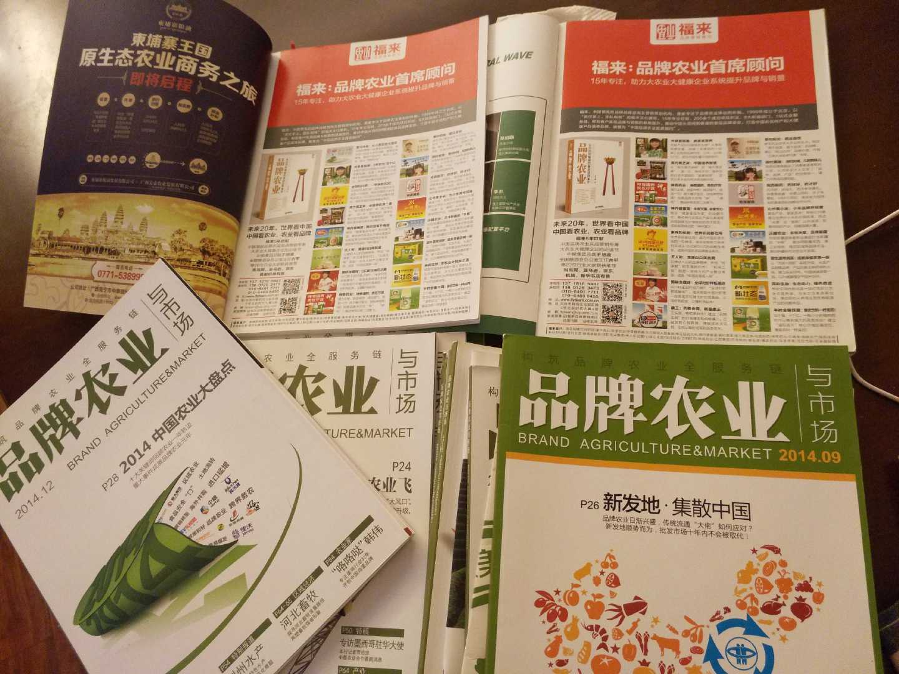
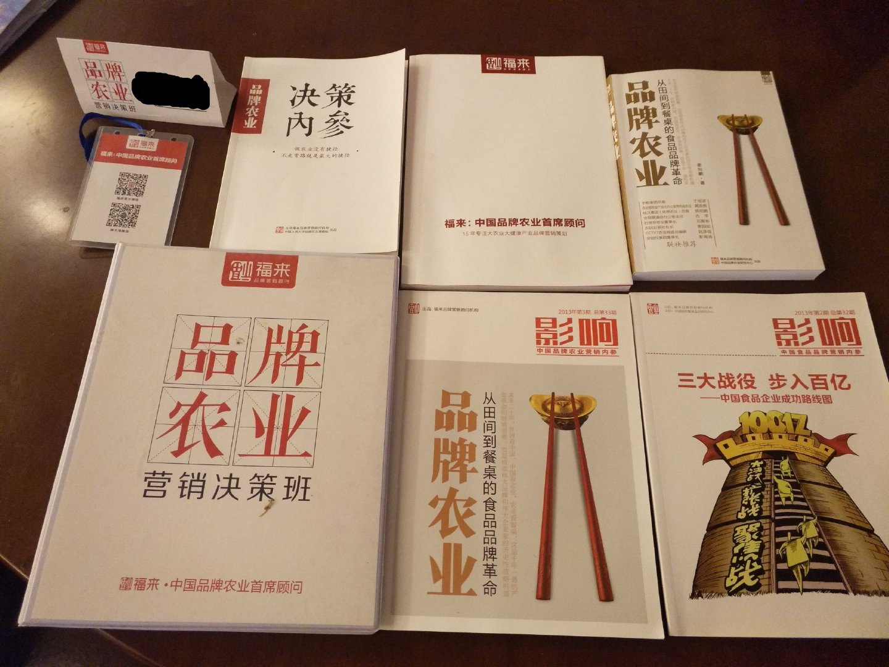

# 《品牌农业与市场》杂志

由于过去多年从事农业食品电商的关系，我参加了很多展会活动，经常碰到《品牌农业与市场》杂志，一来二去地熟悉了，于是给我免费邮寄了几乎全套的杂志。我当时在知名电商某宝从事农业产品运营，纯线上工作的很少用纸质版材料，偶尔翻一下，发现这个行业杂志确实有些特色。起初，对线下媒体的一些事也没搞明白：

* 都网络信息化时代了，居然还出纸质版的杂志？有客户吗 ？
* 怎么这大牌杂志社的总部在石家庄，而不是北上广 ？
* 为啥有很多其他品牌营销顾问公司（中间商）的广告在里面 ？
* 杂志刊号为什么又叫《糖烟酒周刊》？

随着案例见多了，就逐渐发现农业食品行业的现状：偏远落后、人少（ren sha）、钱多好赚：

1. 偏远落后：大部分的农业和食品公司地处偏远，其科技装备能力普遍落后，从业者的平均教育水平较低，与之配套的媒体也比较传统，许多农业食品的老板看重的还是常规的纸媒广播电视等为主。虽然该杂志在农业食品行业中鼎鼎大名，可毕竟不是家喻户晓的时尚娱乐型媒体，受众面没那么广，不在一二线城市似乎也很合理；
2. 人少（ren sha）：别说偏远落后地区的办公室少有年轻人，甚至连办公室都没有，只有厂房农田，还有一帮上了年级的农民大佬粗，所以产品的品牌包装广告营销等时髦的活儿都得外包。无论传统杂志还是新兴的线上媒体，盈利模式当然是广告，极少人争抢，而机会无限多，所以在农业食品行业做广告的有福了；
3. 钱多好赚：任何社会都离不开最基础的第一产业 — 农业食品，虽然平均利润率低但流水量大，尤其我们是个吃货超级大国，越落后的地区，其恩格尔系数越高，收入的更大比例支出都是农业食品消费。80年代初开放市场后，由于物质匮乏，商品的可交易品类很少，农业食品因此成为最挣钱的行业，其中糖烟酒的现金流比例特别大，糖烟酒率先做得起广告，所以当时就出了一个媒体叫《糖烟酒周刊》，这可能是改革开放后最早的媒体之一，下面的故事很能说明情况：

> 矮大紧同学早年第一桶金：

> 90年代初从清华退学，到电影学院学习并在某电视台实习编导，去成都拍一个规模特大的糖烟酒交易会的纪录片，和三个电影学院的学生商量先找些广告拍拍挣点外快。

> 一天晚上，在卡拉OK厅，他们碰到一家葡萄酒厂的人，“我给编了个广告语：‘想活九十九，常饮某葡萄酒。 ’厂长特高兴。后来厂长说，给我们拍个广告吧，多少钱？我们一咬牙说八千，厂长二话不说，给了一万六，拍两个！ ”当时高晓松的工资才200元，公务员工资才72元，四个人拿着1.6万元像犯了罪一样。“两个广告的制作费用大概是2000多元，剩下的钱四个人分了，每人揣着3000多元。平生第一次赚那么多！ ”

看到这，是不是觉得特别扯哈？与其说矮大紧油菜花，还不如说改革开放红利好。尽管当时做广告很挣钱，矮大紧毕竟是个特别追求上进，向往诗与远方的文青，并不屑于投身世俗的行业，否则后来我们就看不到《同桌的你》和《奇葩说》了。

《品牌农业与市场》杂志每期都列了长长的营销顾问公司名单，这在其他行业媒体上很少见，一般其他新兴的比较年轻时尚或科技行业，例如娱乐，时尚，金融，网络和计算机等等，都是自己做品牌营销，较少需要委托外包顾问的情况，即使10来个人的小团队，可能也有1-2个刚毕业实习的大学生承担几乎全套核心的VI/CI，品牌设计和整合营销工作。除非是名列行业top位置的金主，不差钱请得起国际或国内4A广告公司做那种电影大片级的传播。

农业食品业的营销顾问公司不单多，而且规模和阵势小，可能在国内＞10A+水平，未见中国4A，更没有国际4A的影子。其特征就像我们的农业食品公司一样很多且小乱散，我觉得这样也挺好的，说明这个落后的行业还有很多机会，也确实需要营销服务，只有围绕产业链的生态好了，农民企业家们才能赚到钱。

在该杂志列出的众多品牌营销顾问中，有一家可能花了不少钱做广告，几乎出现在每期杂志扉页整版的黄金位置，经常在行业会议活动上碰到其董事长做演讲，名号特别醒目让人印象深刻很大很亮眼：**FL. 品牌农业首席顾问。**若非特别才能，没人胆敢自称天下第一。

### 

在下一篇文章中，我与这家品牌顾问公司邂逅了。

