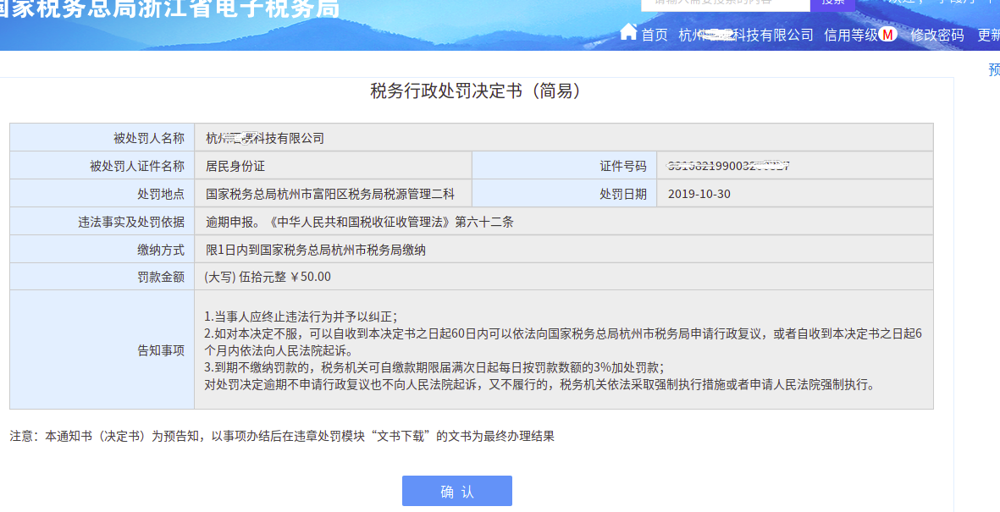
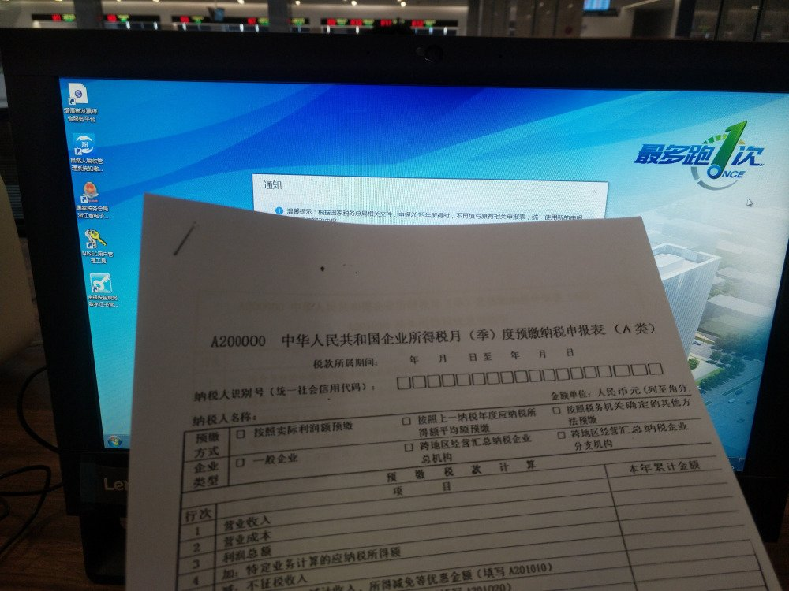

# 税务局老王，别再打电话了！

最近和税务局的交流过程挺有意思，记录下来，值得相关部门好好琢磨一下。

我们是从事互联网和计算机技术的独立开发者，受到杭州某科创园招商引资邀请，到FY区注册了一个小微创业公司，我们本来想搞一个个体户10-50万注册金就好，园区领导说要把我们科技型企业好好扶持起来搞大，建议注册个1000万，然后我们折中了一下注册个500万吧。

注册好之后一年多过去了，科创园那边开过几次会，涉及多方合作经营问题，管理层也换了几届，对于企业入驻园区和政策扶持的事情没有兑现落实什么，我们也一直没有搬到那边办公，这个新注册公司未正常运作，小团队的创始人是近两年毕业的学生为主，刚开始起步，没有受过财务培训，不熟悉税务系统情况，有兼职的财务。  

## 催缴罚款

直至2019.10.23号上午接到一个电话，本地中老年男子口音自称税务局的，态度强硬地命令我们赶快申报税务，否则要罚款了，我们当时有点蒙，以为是网络诈骗电话，我们并没做什么业务，小微企业哪儿来的税，想不起来还有这档子事。

当天下午又连续接到同样的4-5个催税和罚款的通知，我们还差点当做骚扰电话屏蔽了，经过财务网络查询核实，过去季度确实有一笔小订单是走了这个长期闲置的公司账户，也确证来电号码是该区税务局，打电话的是该局片区管理员王××，然后就着手准备材料交给财务处理吧。

第二天10.24号，这个税务局老王从上午10点到晚上7点，又连着拨了7个电话，有的我接到，有的没接到，像上级领导居高临下的口气，继续粗暴催促，要我们到税务局去一趟。我告诉他，通知这么迟，要先上网弄的，他说线上办不了，得线下办理，直接去区里的行政服务中心的税务大厅赶紧交钱。

我们的兼职财务在报税方面是个新手，一听这样说就慌了，赶紧带着所有材料包括公章等，当天中午就打车到几十公里外的区办税的行政服务中心，经过挂号排队等待，办税人员看了情况说，这种申报业务直接网上自己提交就可以，也没有什么罚款，不需要跑到大厅来办。

财务跑那么远费了大半天时间，啥也没办成，只是得到一句话，悻悻地回来了，到家已经8点多，但这是最后一天，要抓紧时间提交，连夜整理材料，遇到电脑故障不能登录等问题，搞到深夜当天没有全部提交完成。

第三天10.25号，老王电话一接通就质问为什么不快些交钱，到我们局里来交2000块税和几百块罚款，罚定了，还要信用评级扣分，拉黑名单 ……

那意思是你不来就要把你收拾怎么的。

## 求教领导

我们确实也郁闷，不早准备，已经过了最后期限，反正是要去交罚款的，我们能怎么着？于是财务将已经申报的材料撤回，再延迟几日继续整理提交各种票据凭证吧。

**临期才通知，是不是有钓鱼执法的意味？**

然后我通过办税服务热线12366，找到税务局钱科长电话，反映了“初创小微企业，财税业务不熟悉，通知办税期限太紧，管理员态度糟糕，不懂业务乱指挥，我们耽误期限，望换个好的业务指导员，以求尽快完工”，希望领导给个说法云云。

钱科长回复：老王年纪大了，脾气可能不太好，他只是一个电话催税的办事员，也不是什么领导，不要怕他；税务局本来就没有通知的义务，办企业要知道这些常识，如果再延期会罚得更多。该罚的款，尽快交了，并允诺信用评级方面可以协调一下不扣分，以后有什么业务问题可以电话问科长。

感谢领导这么平易近人的通话，稍感宽慰，我也和他说明，我们实际办公地址不在该局辖区，过来一趟不容易，遵纪守法纳税是公民应尽义务，没有人会公然违抗法律，得延迟几天才能到线下税务局跑一趟，希望尽量减少我们跑路的时间，大家确实都比较忙。

接下来两天老王又挂了几通电话，通过税务系统看到我们撤回了已经提交的申报材料，似乎对我们想做0申报表示震惊和遗憾，说“怎么能撤回？你看着办吧…… ”，没有再高声厉喝的官腔，可能是领导交代过注意态度而有所收敛了。

明确这是骚扰电话后， 月末几天对老王来电均置之不理，我只回复了其中一个电话，明确告诉他：我们自己会学习，并根据网络系统提示来办事情，不需要听你讲什么，你指导业务不专业。  

## 系统改进

财务是90后小同学，每天埋头忙着很多活儿，佛系得像个未成年人，说未成年人犯得着和成年人纠结生气吗？办事的时候是冷静的，然后说起来觉得这没道理，肯定还有不少人被老王们带坑里去了。

我们希望这个系统有改进。

### 官威

老王别再打那么多电话了，年纪都到我们父辈或爷爷辈的人，也该退休享享清福，有必要还和我们毕业不久的新同学一起那样拼么？换做谁都不喜欢听这种粗暴官腔，都什么年代了。

一些事业单位公务人员，在同一个岗位上兢兢业业（坐井观天）一辈子不了解外面的世界，也许枯燥重复的作业和贫乏的工作环境会限制想象力，只知道敬畏上级领导，不知道人与人之间互相尊重，对待下属和人民的态度尤其糟糕。

像老王儿女这个年纪的时候，我们团队小伙伴就有人出入联合国大会等国际重要场合，什么世界级富商牛人和各国部长政要没见识过？老王你才多大的芝麻官儿，哪儿来的官威冲我们发飙呢？

我们知道，即使罚款和交滞纳金也没多少，我们没工夫搭理这茬子事，甘愿缴点罚金怎么了？让我们大老远跑一趟损失时间和钱更多，能远程办就尽可能不跑实地。

但老王不会替咱着想，还没到罚款的时候，就惯用这种胁迫的口气“xxx 你过来一趟交税罚款扣分”，就是要让你跑一些没必要跑的路，有必要吗？可能他面临着（税收）业绩指标，也让我们分享一下压力，我们替你分享坏情绪，你可以替我们分担企业经营成本吗？

**老王开口说话不单破坏和人民的关系，更毁坏政府形象和公众信任，给组织脸上抹黑。**  

### 互动交流

我认同所有的组织都没有通知的法定义务，因为“通知”这个词在当前的语境里很有官僚意味，常用的“下发通知”就是居高临下的单向沟通模式，只能我讲你听，而且必需接受；  
如果你想自下而上沟通，往往没有回音，或像踢皮球遇到高墙弹回来。既然有收费（税）的权利，就一定有相应的义（服）务，包括正常的互动沟通交流（不叫通知）和（财税）业务培训，只收钱不服务就是强取豪夺。

既然没有义务通知，连着几天拨了20多通电话是个什么操作？通知变成了骚扰电话。请老王的领导- 钱科长解释一下。

所以钱科长一句话“没有通知的义务”甩包袱也是不对的，能甩到哪里去？还不是甩给上级部门，说没有这样规定我们的工作，所以我就不动了，这样缺乏主观能动性，就是被动地挤牙膏工作模式，让人民觉得国家公务员真冷酷无理。

然后迫于（税收？）业绩压力，又违背工作职责主动拨了电话，因态度粗暴拨打太多造成骚扰，导致用户投诉举报，这样能干得好？

老王们的通知或不通知都是尴尬的，左右都不是人，不知道该怎么正常地工作了。  

### 指导培训

不认同钱科长说的“有业务问题电话找我”，这个说辞算是搞搞人际关系的小聪明，在当时情况下仅仅是为了缓和下气氛，真实业务没有这样操作的。

试想一下，在一个IT信息业极其发达的年代，很多业务已经能通过互联网办理了，还有个科长和你说“有事来电话找我”，意欲何为？听你口述学习业务？还是搞搞个人关系，约饭局 ？……

回到我们为什么迟迟未申报的问题上，确实我们初创小团队不懂财税业务，我咨询过12366和税务局电话，也证实了科长没有指导或培训业务的职责，而且科长明确表示其他科员也没有这个义务，那么他怎么就可以揽了这活儿呢？谁敢经常往科长那儿打电话问这问那？所以他表面关心示好，实际等于敷衍，啥也没说。

哪个部门有指导和培训业务的职能？看哪些教程？这些问题还没搞清楚。

通过紧急学习才知晓，有经验的老财务那里才是唯一的途径获取到这些在学校学不到，在社会上四处碰壁的“学问”。相信很多朋友都有同感，你到政务部门办事，经常碰到的都是一张张冷脸，他们不明确告诉你有多少步要走，中间有什么坑怎么避开，每走一步，他们就和你零碎地说一点。

从来都没有一份完整的教程和指南，即使有，也是那种说不清道不明，只有他们能解释的办事程序，可能一件简单的事情，到了他们那里各种出错，要跑很多趟才能搞完，还不给你好脸色看。

其实网络时代的人都明白，碰到问题首先上网自己搜索找答案，可是当前大多政务类网络内容的质量堪忧，且不说粗糙的网站和软件设计，糟糕的用户体验流程，说明文档往往看了也不太明白，还是只能回到实地或电话找他们问。而且还经常A窗口的说法和B窗口还不一致，然后转给C窗口，说要请示领导答复。

都9102年了，还有什么业务是通过互联网办理不了的？我们碰到的这点问题算什么？不过是业界应用多年的非常成熟的财税政务系统ERP的一点功能而已，为什么还要用人工，反复多次还搞不明白呢？国家在这方面的投入还少吗？

单就发通知这么简单一个功能，可以短信息，机器语音等多种方式，如果一定要人工发语音信息，可以自建或外包呼叫中心，请有经过专业培训的客服接打电话，成本越来越低，为什么让一个不专业的等着混日子养老的人操作呢？才多大点鸡毛蒜皮事，就系统性地大规模浪费大家时间和国家资源，还让领导殚精竭虑了。  

### 地址在哪儿？

老王和钱科长都让我们到税务局才能办罚款，可是在税务系统平台里找不到办理该业务的具体地址和联系电话，包括平台的“行政处罚决定书”里也没有标示地址，经过网络查询，发现税务局所在地不是我们熟知的行政服务中心，通过当地朋友线下核实，发现网络地图上的税务局地址确实是错误的。

于是再次电话和钱科长核实办事地址，他只说在715所附近，讲不出来详细地址门牌号，地图里我查到好多个715所，而该辖区的715所旁边并没有什么税务局。

我们电话里同时登录高德地图，他指出办事地址附近有哪些其他的地标建筑物，标注了一个叫“财税干部学校”的单位。

我：“国家办事机关的地址比较隐秘嘛？这么不容易找”。

钱：“都是公开的，只是搬家了，地址还没改过来，本地人都知道715所，你们外地人不清楚吧”。

我：“你们可以向高德地图申请标注一下正确的地址单位名称”。

钱：“这不是我们的职责，上级部门的事，换地址是他们才能决定的”。

我：……

就这么一件小事都要麻烦科长，我能说什么？仅仅要一个办事地址都要打两次电话聊了差不多10分钟，这样的效率和脑路，在追求进步的企业和组织里，是不是该破产下岗了？  

## 终结

经过一段时间了解，对比传统的税务局或各种局的政府事务部门，发现12366和行政服务中心的电话客服更专业规范些，大部分工作人员比较年轻，有耐心，讲话清楚，也不会随意冲人喊叫。毕竟“服务中心”还有点“服务”，里面的人有点服务员那个意思吧，原来“为人民服务”的正确地方是在这里。

而各种“局”里无论有没编织的都是领导，给局子停车场看门的都是你“大爷”，在一线城市的局一般会比较规范守法规，其他小地方就难说了，有的局子看门大爷一言不合就能专针对你的停车费从10块涨到20，还能开出发票来，大爷就是大爷。

一个同样从阿里出来创业的老乡坦言，回老家第一年注册农产品电商公司就搞怕了，一件小事都会让你跑很多趟效率太低，大多数时候局里的人你只能搞搞关系，人情世故的社会复杂，直至今天依然如此，然后被迫无奈放弃回乡注册公司，把重心返回到大城市发展了，而此时他的年营业额已经上千万。

再说回我们的事情，11月初的周二，财务同学再次带齐了材料，驱车几十公里先去了行政服务中心线下咨询清楚，将所有能够网上办理的业务功能都开通，工作人员在电脑上点几下，几分钟办完了。

通过办事窗口查到我们企业的税务管理员，自从注册公司到现在的1年多以来，我们第一次知道管理员是另外一个名字，不是老王，那么确证老王真是税务局专职电话催债的？

然后根据提示，又驱车6公里去税务局，初次见到我们的管理员，并拿到了老王一直在催促的罚款单“税务行政处罚决定书”，罚款100元，与在系统里查询到的50元有差别，管理员解释是新制度，没时间和他们计较这点钱了，赶紧拿了单子交完钱进入下一步，提交申报材料和交税必需再返回行政服务中心，那边4:30下班。

此时周三工作日下午2:30-3:30，整个税务局办事大厅里大多数窗口没人，稀稀落落3-2个办事的企业，楼上老王们和税务管理员办公室里，说说笑笑吃吃喝喝。路上和本地司机聊，说很多财税业务在国税已扣掉，地税的人没啥活儿干，是个闲职。

【难怪老王有那么多时间打电话，他闲得慌啊，盼我们过来看望他，连着几天打了20多个电话，说你过来，过来罚款啊！我们跑这么远往返几趟花了半天时间，来这里仅仅是拿一张单子，跑路的成本比罚款高好多倍了】

我们确信已经开通了所有线上能够办理的业务，还有必要多跑一趟？为了稳妥起见，再打一通电话咨询12366办事程序再行动，经过漫长等待，客服花了8分钟和我解释清楚。可否线上办理少跑一趟？客服回答是否定的。

从税务局再次驱车6公里返回行政服务中心，好悬，此时已经接近4:00了，再挂号排队轮到办事窗口，领到几张表，要手工填？是的，网络上锁定了我们已经填好的资料表格，不允许自助提交以及税务局管理员提交，只能再次手工填表，由办事窗口工作人员手工帮我们录入。

办事员催促我们：快点，4:30要下班了。

财务小同学看着密密麻麻的表格，盯着查询屏幕上“最多跑一次”的标语，感动（委屈）得抽泣了，没有这么整人的，我们企业天天996，你们公务员双休4:30下班，还催我们？这还有天理吗？

花了半天时间才搞完几张纸，感觉时间其实够宽松的，但是经过局里就变得很紧张了，比我们自己日常工作节奏有得一比。我们日常的工作时间掐得也很紧啊，有时候一上午都忘记了喝水，等到上厕所的时候，才发觉膀胱憋得快要爆炸了。还是公务员好啊，每年无数人都削尖脑袋往里面挤，但我们真不稀罕这种岗位。

4:35 终于办完，感谢工作人员耐心等待5分钟，再见，再也不见了！  
  

全国各地都在做创业园，鼓励大众创业万众创新，我们收到很多邀约，许多地方政府和投资者给政策支持，你们这样整企业，我可以去别处，世界这么大有的是地方，还非你莫属吗？

我们本来就没有占用当地的什么资源，还经常碰到这么咄咄逼人态势，要么把公司注销掉，回去立即就办。

公务员队伍里某些同志有学习能力不足的情况，根源是体制问题，企业和公务员都是受害者，企业承受不必要的负担和成本，而公务员浪费国家资源荒废光阴干些无聊不必要的工作。

打造服务型的政府是普遍共识，浙江的政务系统改革走在全国先进模范的最前列是众所周知的，怎么会还有这种落后低效缺乏觉悟的小集体呢？

浙江的互联网产业也走前中国最前列，我们小团队就是做技术开发的，熟悉怎么做信息系统，提高工作效率和精准度。回来路上和小伙伴立下誓言，我们的目标是研发更好用的管理平台，将类似案例中的受害者拯救解脱出来，将低效率浪费资源者淘汰出局。

