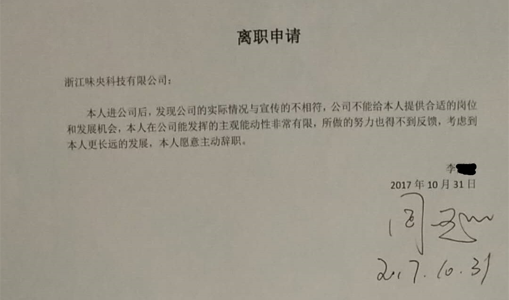

# 给网易董事监事的信

~~尊敬的~~网易董事，监事，

## 站在消费者角度看

作为网易旗下味央品牌曾经的忠实顾客（不明真相的韭菜），我过去一年多里订购了2万多元的产品，由欣赏惊喜（被吊足了胃口）到厌恶失望（看破真相），现在已经退掉全部订单了，不再向亲友推荐味央，不信任这个经营团队，不相信其做出来的产品。

现在提出以下问题：

1. 宣称黑猪听音乐，实际情况是有人参观时放一下音乐，人走之后就关闭？到底是给人听的，还是给猪听的一个营销的噱头？更大的可能是借着“有钱的丁爸爸”宠爱的傲娇女神猪小花的名，给网易云音乐做推广吧？
2. 宣称专注中国本土黑猪品种，玩了一个文字技巧，给消费者传递的概念似乎是纯本土品种，没有与洋猪或其他品种杂交吗？（作为消费者，我并不介意杂交品种，你能不能给自己人也说实话啊？）
3. 宣称国际领先的动物福利标准，有请第三方专业机构认证和评估过吗？核心区的母猪妊娠区能看看吗？（消费者并未要求非采纳动物福利标准不可，本质是想借着好名声，却不付出实际行动）
4. 宣称第4代养猪模式，是什么？第1,2,3代分别是什么模式，有什么差别？（我了解味央2年了，还不清楚，请科普一下）
5. 宣称6个人养2万头，安吉农业园实际能养多少？还有多少猪是在其他地方代养？代养的农场环境也和新闻里照片一样吗？安吉自营农场实际有多少个饲养员和生产人员？
6. 如果没有网易大平台的品牌加持，没有丁总的个人信用做背书，相比其他同行，味央农业有什么核心竞争力和优势吗？

## 站在员工角度看

年底大家都在写总结，作为网易农业事业部的前员工，我也把积攒在脑子里很久但始终没有得到答案的疑惑清理下：

### 养殖场自动饲喂设备

1. 味央现有农场的自动饲喂设备为什么出现长期罢工情况？为什么很长时间都修不好？一年能正常运行几天？
2. 为什么设备维护工程师没有到岗，就已经把设备采购，安装和使用了？
3. 味央总经理说在中国找不到这样的设备维护工程师，这个设备到底有多复杂？还是另有其他原因？
4. 为什么没有按照设备供应商的要求和使用说明进行施工安装和日常运维操作？
5. 夏季电力供应不足，白天经常宕机，设备采购和施工之前没有经过规划测算吗？
6. 谁当初负责采购，施工和验收的？
7. 味央宣称养殖水处理达到饮用水标准？是谁忽悠直播主持人和丁总喝猪尿净化水的？（水处理工程师将水处理数据发给我，经过与国家饮用水标准对比，发现多个关键指标是空缺，实际甚至连污水排放的二类，三类水质都达不到，我把对比结果发给总经理看，他始终没有回应。这种遇到问题躲避的情况让人很恼火）

我曾经与荷兰工程师一起去检修设备，然后提交一份30多个问题故障的清单报告，发送给总经理和生产部门同事，但没有人回复这些问题并宣称对其负责。这有必要对各问题环节进行调查，包括钢架结构的基建部分，确认是否有违规情况。

在网易杭州研究院从事工业自动化研发的W同学，对自动化饲喂设备情况了解更多，你们聊过了吗？

### 技术管理

我认为网站上的这些对外宣称都是虚空的不切实际的：

* 系统全面的饲喂数据 ？
* 严格执行国际领先的动物福利标准？
* 养殖全程遵从动物天性表达？
* 保障猪群健康快乐，提升天然免疫力？
* 从出生到育肥量身定制生长环境？
* 猪只电子身份信息，个体化饲喂？
* 开放创新、持续友好的品牌愿景？
* 全程可控的生产体系与创新定制的智能管理？

原安吉农业园负责养殖和动物研究的小李同学应该很清楚这些情况，她会说真话，但是已经被离职了。

### 公众评议

在互联网信息化时代，世上没有不透风的墙，公司实际运行状况如何，其实业界同行很多都是知道的，反而公司总部办公室的人不知道，局外人甚至比局内大多数人知道得更多。

因为农场搞一线生产的员工很清楚，每个行业都有自己的圈子，农场的员工会与外界同行保持联系，私下沟通避免不了，任何掩饰和亏大其词，通过社交网络在同行圈子里无限地传播和发酵，甚至产生各种造谣和负面信息传递给同行的客户们，让互联网上吃瓜群众围观一下，同行和员工们则私下会嗤之以鼻。

一些人像寄生虫一样留在生物体内啃噬，对各种问题视而不见窃窃私语，自己都觉得在被动地干着些无聊的工作。

做实业的总体是要踏踏实实，大家已经习惯虚夸的行业潜规则，私下里说说，不会公开讲，怕得罪人，彼此心照不宣，没准哪家状况更糟糕呢，所以吹牛也要量力而为，先估量一下自己的水平，最可怕的是从业者对自身也没真实的认知；

生产者不知道自己是谁，而消费者也更不知道该相信谁，我一个内部人都没有知情权，更奈何外部普通的消费者？没有知情权就没有选择权，市场继续混乱下去，虚假吹牛的本质就是在扰乱市场秩序，应该被关进公检法的牢笼。

味央做不到“如实告知，公开透明”，脱离不了行业潜规则的引力陷阱，把自己包装成所谓的“行业一股清流”！不愿开放，就所谓核心的商业机密，这只是为了掩饰自己的无能，缺陷和错误，并非真有什么发明创造或专利技术。

大家看味央就像围观动物园的一个新奇物种一样竖大拇指，潜台词是“你有钱，真会玩，你牛X ……”。

### 价值观/团队协作

* 我问过10余名HR“公司的价值观是什么？”，没能得到解答，只有1位同学回复可能在“员工手册”里；
* 公司内部培训学习404法案，所有人都要上线做一个考题测试，味央行政助理在工作群里直接把答案贴进去，让大家抄上去就可以很快通过，公司允许这样做吗？
* 有一个段子，丁总的父亲有一次到农场看看，在吃饭时，农场的管理人员说竹笋是他们上山采的，茶叶是自己种自己做的？明明是到街上买的，他们为什么要这么说？
* 从安吉养殖场被离职的敢说真话的小李同学，是这样写离职信的：  

* 我曾经自告奋勇地找HR组织过内部的学习沙龙，请欧洲有机农业食品业的行家和质量认证专家来分享，农业事业部数十人，除了我这个主持人，只有一位同事来参加（我拉来的一个摄影师），来的观众都是其他部门，这就太奇怪了。我确定是通过HR的内部平台发布活动信息，并且工作组中每个人都看到了，HR负责活动组织的同学还告诉我有大约20个人报名的，但事后大家才说各种忙的理由，到现在我也没搞清楚这到底咋回事？
* 如果有老大（大家对总经理N总的称呼）下令大家去参加，不会有人缺席的，如果自发组织的，那就可能得拿各种奖品或好吃的去吸引也大概率不会来。作为工作和学习的一部分，不应该花点时间吗？和这样一群被动的工作和学习的人合作共事，这算什么正常团队呢？HR应该承担责任。
* 从总经理和丁总对外宣称的文案来看，声明是采纳“动物福利”标准做生产管理规范，于是我用业余时间带志愿者编译了数十集环境，农业和动物福利相关的视频公开课，发布到公司群，征集大家意见。
* 市场部和生产部的同事也没有反馈，私聊后发现，他们对这个根本不感兴趣，没人想看这个主题公开课，没人对这个上心，想借动物福利之名，却不愿付诸行动。（典型的“嘴上有态度，行动很诚实”）
* 2017年会上，周X（小李在猪场的上级生产主管）对我说：“动物福利？做公益对我们有什么好处？我们不招吃闲饭的大学生搞这个……”，幸亏我是招志愿者做的，没有给公司带来什么负担，否则也要被这些人当靶子打了，这样的生产部能做出丁总想要的“匠心”产品吗？
* 公司高薪请了那么多人在办公室里做文案，美术设计，公关，活动策划，除了少数几个人因工作需要去过农场，其他人不知道里面的情况，只是看照片觉得干净整洁，被告知一些故事，然后就是根据这些印象来创作各种的品牌包装。
* “过度营销”产生的成本算到商品价格中，由消费者买单，这种常规商业套路，只要有钱就可以做。这个时代最傻的营销就是烧钱自卖自夸，这样的市场部能获取忠实顾客？能做出什么正确的营销吗？
* 味央现有工作人员，是否秉持公司价值观？正直，诚实，敬业？有多少人敢说真话？没有弄虚作假，不会瞒上欺下？

### 离职

味央倪总一直忙，很长时间也不开会，我不知道他在干嘛，发工作邮件给他和相关同事，经常不回复，要么回复一个“好”字；

找其他同事商量工作时，他们会说：“这事你得问倪总， ……”，这种踢皮球的游戏玩多了让人厌烦。

我最终只好选择找总经理同级或更高一级的管理层的人聊工作，看到董事会里有一位叫蒉X春的副总裁，于是发了邮件，蒉总第一时间把这事告诉倪总，倪总和HR沈X非常不高兴，于是HR当即要求查看我和蒉总的来往邮件及通话记录。

每次看着倪总经常焦虑烦躁的状态，我不想影响他工作情绪，也不和他多说什么，本来平常就没什么沟通。为了防止HR接下来经常给我“穿小鞋”，就按照他们的“意愿”写辞职报告吧。

过去在职的一年多里，我还多次约HR聊工作，她也一直都很忙，总是不能如约，除了入职第一天坐下来谈10来分钟，第二次谈工作就是这最后一次，她催着我赶快三天内办离职。

在这最后有限的几分钟对话里，她的谈话重点主题之一是“倪总给你机会来这里工作，应该感谢他 ……”。我觉得HR的思路不对，我愿意来这里工作，是不是他也应该感谢我？我应该效忠于公司，效忠自己的价值观和理想，为什么是效忠一个我本不了解，不看好也看不懂的人？

HR说发现某某同事不合适，就叫人家写辞职报告，那么她和总经理早干嘛去了？把不合适的人安插在岗位上，让公司承担损失，浪费大家彼此大量的时间，到底是员工不合格？ 还是总经理和HR不合格？

我们其实一点都不傻，懂劳动法的，但扪心自问也没给公司带来什么贡献（还要啥离职补偿啊！），所以不会提离职条件要求，要点脸皮或有些正确想法的人，自然融入不了这个团队。

如果像其他人一样做个（一点儿也不）精致的利己者赖在公司混日子，那又能怎样？HR写不出正当辞退我们的理由，没有客观业绩考评标准和个人主见，甚至连一份像样的绩效考评表都拿不出来，她只会听老大的，仅仅因为老大不高兴了（这个喜欢被叫做老大的总经理，是土匪或是黑社会吗 ？），觉得有人在挑战他的权威，他就要排除不会吹捧夸赞并发出逆耳声音的人。我只看到他们经常有情绪，没有看到其他什么优质能力特征。

他们不知道公司需要招聘什么样的人，也不了解自己的团队，当然我们互相彼此也不了解。

我所看到的味央团队越来越像是让网易养猪成为一个笑话。8-9年了，全社会都在期待味央的蜕变，成为中国畜牧行业的一个真正的标杆！公众可以如愿吗？

祝大家新年快乐如意！

小匡  
网易农业事业部前员工  
2017.12.28

