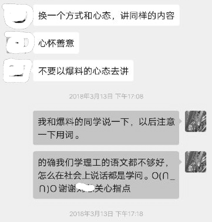
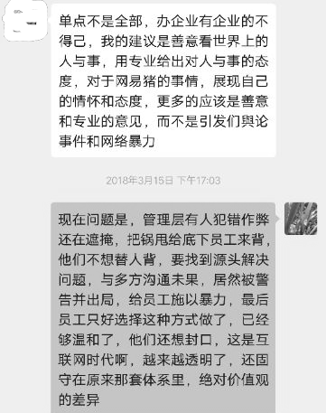

# 夹着尾巴做人，污王

## 副总裁：夹着尾巴做人

副总裁L总是我接触的第一个网易人，值得被记录下来。

### 引路人

2015年11-12月某天，我接到一个自称阿wei的猎头电话，说总部杭州某top5网络公司的生鲜电商项目，找运营和产品负责人，搜到我的履历很符合。于是进一步了解客户是网易，网络大厂中就属丁磊养猪最吸眼睛，多稀罕呐，当然有兴趣接洽了。

当时我感觉特别奇怪，网络招聘这么发达的年代，怎么还有这种通过传统中介招聘的方式发生在互联网公司里？也许是我涉世未深，孤陋寡闻，隔行如隔山，实在无法理解这种线下模式的人力资源中介行业，也可能是我一直职业太顺利了，总是有人引荐或直接就聘上了，没有经历过传统中介，就觉得不能理解。

然后阿wei给我约到杭州城西一个茶馆，来人是网易某部门副总裁L总，一番寒暄得知他也在阿里待过，感觉拉近了一些距离，那次聊得很high的样子，展示了我亲自参与经历过的不少业界热门项目案例，分享一些外行不知道的客观现实情况和新观点，有问必答难不倒我。

但L总提的问题太多了，他们是一个做时尚服饰品类的电商部门，从未摸过农业和食品，丁磊却让他往当时特别时髦火爆的生鲜电商赛道上开，预备内部组建团队孵化生鲜品类。他们不仅缺乏对市场行情的了解，还缺乏对农业食品行业的基础认知，临走我送了一本当时在看的书《农业与工业化》给L总，还提供了很多线上可查询的资料线索。

可能他们觉得我对农业品类确实经验丰富，然后又约到网易滨江总部聊了两次，很明显我对网易养猪兴趣大，于是把我转介绍给了另一个部门网易味央（可能L总早已预料自己的部门干不久），也就是传说中养猪的网易农业事业部，和味央总经理N总几次下来也聊得不错，最终在L总部门HR的撮合下，就这么签了劳动合同。  
（然后阿wei让我第一时间把薪酬数字告诉他，我问他怎么知道我已经入职网易了？我不太理解这些操作方式，但也没好意思多问，也许是人力资源中介的行规吧。后来据说他女朋友在网易HR部门，也是他推荐进去的，对内部操作很懂的啦，可以拿到中介费。我以为是通过L总介绍入职，中介阿wei只是一个间接关系，距离他的引荐已经过去一个多月了，应该和他没关系吧。）

### 夹着尾巴做人

2016年1月份入职第一天，L总引着我进办公室参观，他第一句话说“在这里要夹着尾巴做人，要有敬畏心”，我心里咯噔一下，敬畏心我听得懂，但是“夹着尾巴”是几个意思？难道发生了什么事？上贼船了？当时没来得及追问，既然来了，并已经签字画押，我还能说啥呢，待一段时间不就知道了么。

L总带了一个很大的部门，比农业事业部大，我们即使同在一个办公园区那短暂的几个月，大家都很忙，不可能线下见面，线上的交流也很少，偶尔一个月有1次互发信息问候，仅有一次在园区偶遇L总，应邀去他办公室花了10来分钟分享了一个农业项目案例。

然后不到半天时间，我所在的农业事业部总经理N总，就来找我谈话，很不高兴的样子，谨慎小心地询问我是否去过L总办公室，告诫以后没有他的允许不得和L总交流，之后还反复多次盘问我和L总的关系等等。

我从来都不会主动打探人家隐私，至于他们遭遇了什么？部门领导之间有什么复杂关系？他通过什么渠道知道我和谁谁谈过话的？这就不得而知了。  
（后话：类似这种事之后发生过多次，一个不到50号人的小农业部，他们哪儿来的那么多眼线和耳目？这很像明朝太监派遣特务组织监听臣民谈话打探消息，东厂西厂内厂锦衣卫的太监再怎么厉害，也没有猪场的领导厉害啊！此后我也经常听到同事谈论，N总信任谁谁谁，不信任谁谁谁，好像他睡觉都随时睁一只眼了解周围的风声，很警觉或没安全感的样子。）

我入职后没几个月，L总部门的生鲜电商项目组干不下去了，兼并到农业部门，好多同事过来，人事结构和业务混乱了几个月（然后这些兼并过来的人又几乎全部都离职）。再过不久，L总所在的时尚服饰电商事业部整体被裁掉，然后他离开了网易转投另外一家土豪金多的XG集团，此后我们只见过一次，几乎断了联系。

把别人带上贼船，就先撒走不管了，这不合适吧，耗子尾汁。

曾以为我送的那本书以及相关材料，如果L总看了并且看懂了，可能不至于那么快从生鲜赛道上撤下来。**他可能遇到的挑战还真不是技术产品或市场的问题，而是复杂恶劣的办公室政治和人际关系，只有遭受到多大委屈了才会在第一天告诫新人要“夹着尾巴做人”，真意味深长啊**，非我等凡夫俗子不屑于情商世故者所能意会理解的。

往后我都告诫自己，创业不容易，越是正确的事业，愈显得珍贵！  

### 老领导的忠告

一直到接近2018.3.15消费者权益保护日，小李同学写了一篇在农场真实见闻的自述，参考上篇\[网红猪小花的故事\]，发在知乎，bilibili等社交媒体上，不到半日就被全网404 删帖屏蔽。

就是那位把我领进网易大门的老领导，消失了大半年没有联系的L总，可能在极短时间内看到文章，突然打来电话说了一堆，大意是让我和他亲自跑一趟，去网易向农业部总经理N总道歉，告诫甚或威胁我：  
“如果这样引发舆论暴力，你可能很难在农业圈混下去了，也很难再就业，没有哪家企业敢接收你这种人。”

并发来信息，原文：换一个方式和心态，讲同样的内容，心怀善意，不要以爆料的心态去讲，单点不是全部，办企业有企业的不得己，我的建议是善意看世界上的人与事，用专业给出对人与事的态度，对于网易猪的事情，展现自己的情怀和态度，更多的应该是善意和专业的意见，而不是引发與论事件和网络暴力。

他还表示：虽然他作为副总裁的部门被裁切，离开网易，丁老板待他不薄，给了不少机会，还想再接一些网易的合作项目，还想拿丁的投资呢，不要因为我，让他的生意受到牵连。

**我的回复：**不是每家企业都违规违法的，好像我与全天下企业为敌似的，网易这么大的媒体平台还怕不实舆论吗？心里没有鬼，怕什么？而且猪小花到现在都没红，就公司里的人自己在High，不能太高估猪小花的影响力。  
他们通过网易媒体公关，把我们的稿子删得很干净，不会有多少人看到的，也就一些同行知道，它们能有什么影响力呢？  
我现在不是网易底下一个做错事的唯唯诺诺的员工，而是作为一个购买了它们2万多元产品的消费者，理直气壮地要维权，如果认为我违反法规，我们可以对簿公堂，他们敢吗？

L总没再说什么，后来我有别的事再给他发信息，不怎么有回应，自此就彻底断了联系。

### 老领导的归宿

L总是我入门网易的引路人，按照HR沈X的“感恩”标准，我就这么把恩人得罪了，我从未愧疚过，砍掉不必要的人脉，这是该坚持的处世原则。

L总和我几次谈话都在谴责阿里“刷单，卖假货”，后来我领悟到，他在阿里体系里如果得志晋升获得巨大利益，他可能就不会这样批判阿里了，通过这些事件看得出来，他不是正直诚实和敢说真话的。而且，他也是应该是在阿里遭遇到复杂的人事关系的受害者吧，现在遇到我这桩类似问题，他怎么还是不知道屁股应该往哪里坐呢？

再说，他离开网易后投身的土豪金多的XG集团，听说该集团把整个杭州城的离职的阿里小二都招募进去了，出手很大方，互联网泡沫下，网络大厂的离职者们也身价倍增。我后来服务另外一个客户的时候，刚好和XG集团有交集，深度了解一些情况，感叹这世界真是太小了，想偷偷摸摸干点事，但外面人很多都是知道的。

L总进去后不到2年，XG集团在证券市场一系列风光地骚操作，由于百亿欠债，遭遇流动性问题，从而申请破产重整，几乎一夜之间突然大厦倾倒崩塌，XG集团的老板从女首富变成了“首负”。

中年男人，有家室有孩子，车贷房贷少不了，压力山大，在普遍有年龄歧视的互联网圈，不知道L总还会去哪里找下家？他连自己的前途都没法照顾，却假装老大哥的样子关心小弟的前途，告诫我怎么做人做事的道理，否则以后“在农业圈混不下去，也没哪家企业敢招你”，这是混淆是非对错的恐吓威胁，他这不是关心晚辈的前途，真地关心的是以后自己和丁磊的关系，还是一己私利。

他应该替自己负责，好好关心下自己的前途，怎么这样做出轻率的决定，去投奔一个昙花一现即将破产倒闭的公司？这么不明智和没眼光，如何当上网易一个部门的副总裁并可以亲自向丁磊汇报工作的？包括其他公司的那些昏庸无能的CEO和董事长们，他们怎么上位的？

这类问题我想了很久，后来终于搞清楚了，原来他们只是包装得很好，实际并不具备一个正常的职业经理人和老板的能力，很多新同学被VP副总裁，CEO，董事长的大头衔吓唬住了，以为有什么了不得，其实就是糊了一张虎皮，他们总是想得到超出实际能力抓得住的利益，好高骛远，急功近利，眼高手低，摔下来很惨是必然的了。

我也给老大哥和老领导L总一个忠告：要想在CEO的位置上把事业做强大，先屁股挪到稳固的凳子上，把身子坐正了再谈创业。时常朋友圈分享个什么阳明心学，老子道德经之类的修生养性的书，装模作样地练书法，统统都没用的，别用商人的套路污染了传统文化和宗教经典。

## 市场部的污王

SH是武汉大学的新闻和文学专业毕业的，起初在网易新闻部门工作多年，后来入职农业部门，是农业团队最早的资深的员工（他入职时该部门只有几个人），很聪明的小伙子，同事在一起开玩笑时，SH被封为市场部“污王”，我以前没听说过“污”是什么，后来才知道他们说的“污”是“喜欢黄色段子”的意思。

我理科转文科，就是想饱读诗书，弥补口舌笨拙的先天不足，无奈酒量和段子怎么也学不会，也不喜好饭局，后来也就认了命，知道自己不是做大生意当老板的料。

在每次饭局，团建，聚在一起闲聊的时候，SH大多数时候都会献上几条污段子，有脑筋急转弯的，有恐怖血腥的，还有我们根本听不懂的，网易农业部有了他，饭桌和群体活动从来都不会冷场和寂寞，不清楚这小子是如何形成这种让人羡慕的超能力的。

2017年4-5月我们接待英国著名的动物福利农场主Mark来访，让我给做全程的陪同传话。到了开会时，我才知道CEO，公关，市场三位负责人都不会开口讲话，幸好我预先把PPT等讲解资料都翻译准备着。主管市场部工作的SH同学，拿出我已经转化成外文的PPT给Mark讲网易公司和黑猪产品，第一页还没翻过去，他就着急流汗，挤眉弄眼，磕磕巴巴说不出来话，我坐旁边摸一下他的后背，安抚一下他急躁尴尬的情绪，接过电脑幻灯片按键，代他继续平稳地讲完 ……

送走客人Mark后，感觉到他们对我的态度有点微妙的不同了，不知道这是敬仰还是疏远？这让我有点不自在，我早就不介意你们的学历了，你们和我一个8流的职业技术学校的大专肄业生较个啥劲呢？

正常的大学毕业，至少要英文4-6级达标，日常生活工作的听说读写是没问题的。据说公司还有好几个英语专业6-8级毕业的，难道选不出一个能开口讲话的？如果那天没有翻译跟着呢，岂不丢人现眼？对自己的水平没有个预判吗？

起先不确定他们的水平如何，从实际看远远低于预期，完全无法胜任。他们都是国内211-985系列名校的研究生或本科毕业的，从他们的学历背景来看，比我的出身好太多了，没有任何嘲笑的意思，因为我自己的水平也不咋地，但我应付商务工作生活绰绰有余信心十足。

无法理解他们是怎么考到名校，并拿到毕业学历证书的？人总是有所长的，只要有讲污段子的能力，凭这一条独门绝技，就能在江湖上混饭吃，因为领导喜欢。

### 转基因访谈

食品和农业媒体里总是免不了有关于“转基因的”争论，某次我找SH展开了一段对话。  
小匡：作为一名资深的媒体人，你如何看待“转基因”食品问题，你会吃吗？  
XS：会吃啊，因为便宜 ……   
小匡：如何看待崔永元和方舟子等其他网络大咖关于“转基因”的争论？你站哪边立场？  
XS：崔就是一个大SB，我站在方这一边 ……  
  
这就是作为一个知名农业项目+资深媒体的从业者的认知，这种人会做出丁老板经常挂在嘴边的工匠精神的产品吗 ？

我当时心理确实有点不舒服，不好当场明确表态，因为我们平常同事之间关系大体还不错，但彼时觉得这就是一个大混球啊，跌破三观了。

觉得没法对话了，所以当时没说出来，我的想法是：  
首先崔、方二位老师，都是我所敬仰的敢说话的前辈，有公开的争议是好事，需要文明的对话方式，真理和事实是越辩越明的，尽管他们在某些方面意见不合而对立，这丝毫不影响他们在广大网友心目中的重要地位。

我不懂这种高深莫测的“生物，基因”技术，我就不会参与讨论技术范畴的问题，也不发表带有指向性的意见，不懂就不会选择站队，个人感觉有风险不要吃“转基因”就好。

我们都很清楚崔老师不是技术科班出身的，我们当然不会相信他对技术的理解，我们看中的是他作为一个媒体人的角色，他说的不是技术本身，而是引导公众探讨关于虚假信息传播和知情权的问题，作为一个搞不清楚混乱舆论现状的看客，如果一定要站队，我当然会选择站在崔老师这边，因为我们都不懂这种生物技术，都带着好奇心去探究“知情权，选择权”，跟任何其他问题无关。

如果别人问我怎么看待“转基因”食品，我会回复：当然可以吃啊，那些说可以吃的人就愿意吃，个人选择吧，我不懂这个，对新事物无法做出判断，我自己现在还不想吃，等他们吃好了，证明没问题了，我再吃。但是人家不吃，你不可以说人家就是SB，我们也不能说愿意吃的人是SB，这叫互相尊重，每个人都有自己的选择权，但知情权是前提，不能连一个媒体人带领公众做“知情权”探索的职责都给剥夺，急着选边站队地攻击诋毁崔、方二位老师的人非蠢既坏，他们可能也是受某个利益集团忽悠利用的木偶群体。

SH只是一个普通的媒体编辑，如果非要把他算进推广“转基因”的利益集团里，也只是最底层那种韭菜，他根本不可能得到什么利益，但是，他主动对持异见者发动喊打喊杀的姿势了，这种心理和行为很有意思，就这点认知能力，你上的是什么国内名牌大学？这让人很质疑当前的教育质量或者筛选人才的漏洞。

### 自我感觉良好

在我离职前，SH就已经莫名其妙离职了，他也没有和周围的其他同事告别，我看他有好一阵子没来上班，就给他电话，几次都不接，过了一段时间他终于接了电话，他说自己要回家生孩子，又说已经入职了阿里巴巴，我祝他在新的环境混得好。

问他为什么走了，有什么情况发生吗？我本来是想通过他搞点网易猪场的内部情况资料，没想这伙计守口如瓶，表示没有任何关于工作期间的不适，在网易工作感觉良好，还自夸干得不错有成就感，没有发现什么问题，只是因为家里有事才离开的，要生孩子照顾家云云，当时感觉SH的这些说法大概率是在扯谎，也有可能在阿里巴巴生孩子更聪明吧，挪个窝下蛋，蛋更香吗？

SH是浙江宁波人，公司离家近，那时他说刚结婚，老婆脾气很大，有一回他做错一件事，就被BBB地唠叨一天。还说老婆的化妆品特别多，要低温保存的，买了一个很大的智能冰箱才可以装得下，得好好挣钱给老婆买化妆品和冰箱，现在娶个老婆养家真不容易啊，这货就是一个话痨，只要有他在，公司里永远都有八卦和欢乐，但是为了别人的快乐，你不知道他背后默默付出多少泪水和屈辱，在这个层面讲，他有着崇高品质  ……

作为一名深入农场一线的资深工作人员，他做了大量采购和出纳工作，如果说不知道实际情况（例如采购猪用的兽药），要么就是他装傻，选择了明哲保身，是个（~~一点儿也不~~）精致的利己主义者，要么就是个混账，真滴不知道实情，不能确认是否有其他隐情或被收买封口，总之就是非蠢既坏。

