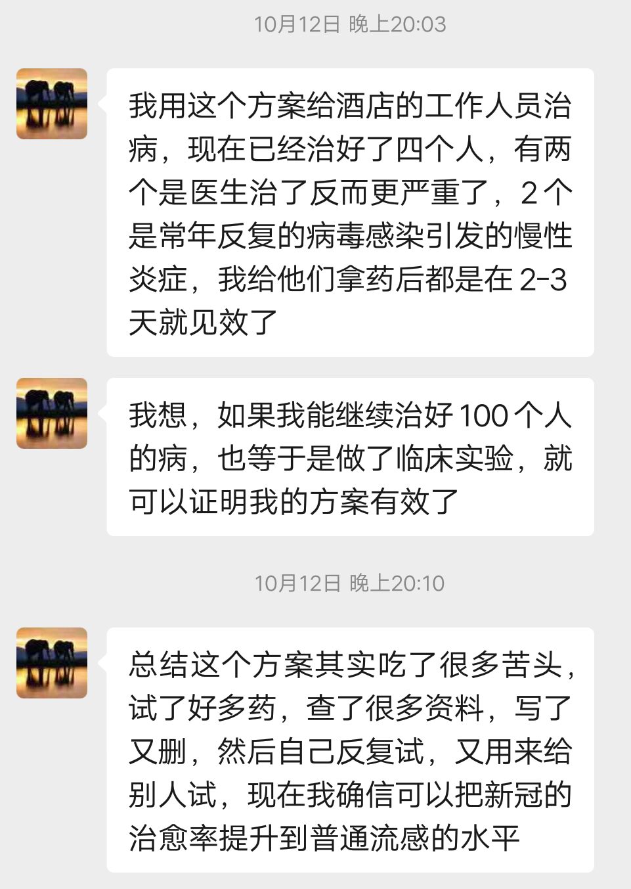
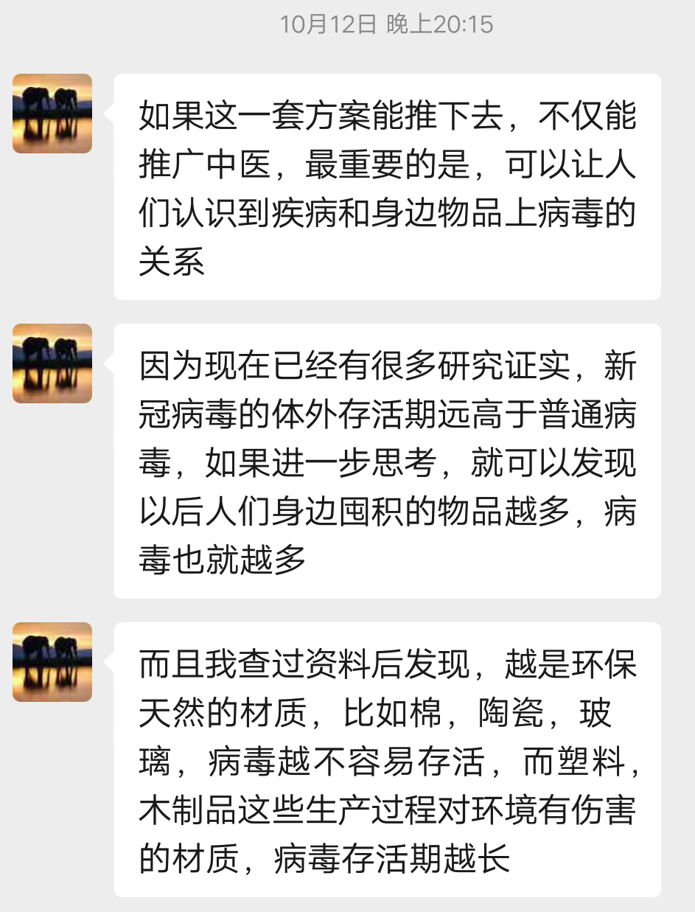
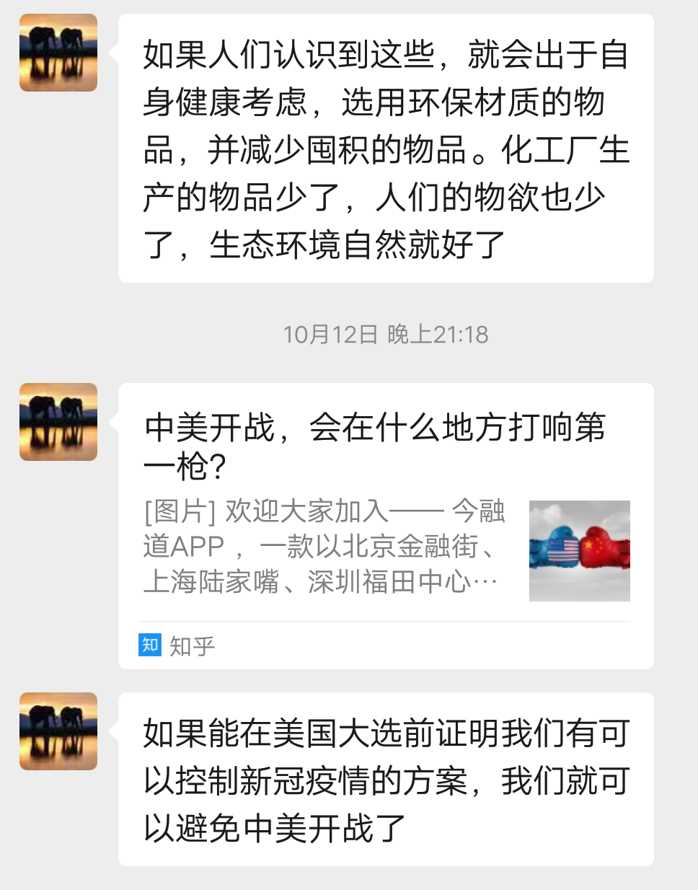
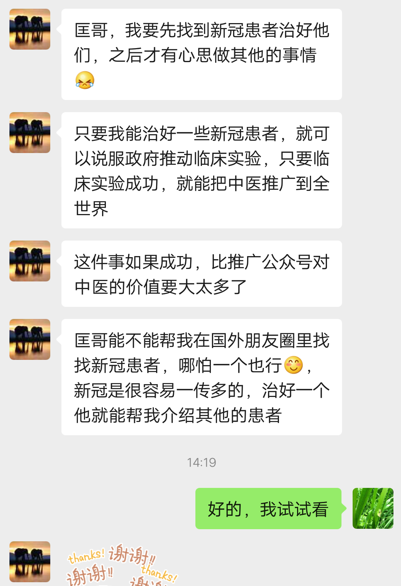

# 一项可能阻止中美战争的抗疫方案

### 严洁自述

我总结了一份防控新冠疫情的方案，如果能临床实验证明有效，不仅可以控制住疫情，还可以推动中医产业的发展。 

匡哥，这是我写的新冠防治方案给梁冬老师的部分，其实还有很多地方要完善。我想趁这几天天气好，先去医院做检查，然后再完善其他部分和素食的方案。 本来应该全部完善好再交给您，但是之前几次尝试去医院检查，都因为抵抗力太虚每次都没撑够半小时。这次想试着检查完，如果有万一，您就帮我直接把这份推送给梁老师，如果顺利，我回来给您报平安，然后再继续完善方案可以吗? 😁

（我提示她：文档中没有你的个人介绍，好孩子啊，愿上天保佑你，我和另一个兄弟小旺协助你。 ）

我的简历不重要啦，现在最重要的事情是想办法结束疫情，如果局势还没有改变，美国大选后特朗普可能就要发起战争了。

中山大学中山医学院，生物医学工程专业（就是一半医学一半IT的学历背景）。

曾任职美团深圳运营，之后在总部从事运营支持，负责梳理城市运营团队的工作流程，绩效评估，效率优化，后台数据报表。 以及曾任网易数据分析师，负责后台数据系统搭建，日常运营数据分析。 

然后自己创业，和家人做干果食品公司，核桃，葡萄干，自己运营的时候子类目在电商平台前三左右，后来因为健康原因退出，头部查出骨瘤，但是良性。 退出公司后在独立开发十年前就想做的教育软件。

年初新冠疫情开始时，和朋友在筹备做一个汇总新冠治疗方法的信息平台，后来住进隔离新冠疑似病例的酒店，第二天开始突然急性腹泻，一天十几次，到后来喝水都会腹泻，怀疑是新冠后，开始从之前看过的新冠治疗方法里找药，但是因为严格自我隔离，生病期间所有事情都自己在做，比较吃力，加上身体本来就不好，导致恢复的非常慢，但也因为这样导致各种并发症几乎都得了一遍，然后试了几十种药，每种并发症都找到了治疗方法。 

我之前大部分时间都是对着电脑，社会经验非常少。而且一碰到要说话表达的事情，常常因为不善于表达闹误会。所以在社交方面，我就是个小学生水平，没有办法像您那样到处都有人脉。

## 与严洁的缘起

小洁是我之前的一个客户，以前印象中，她是一个从事IT技术的女生，“迷信”佛教，“神经”敏感，心善吃素，文静瘦弱。我们在网上几乎没有联系，彼此不算很熟悉，她通过另一个兄弟做中间人给我发消息，当收到小洁同学给我发以上信息，我当时有点震惊了。不知道她过去大半年感染病毒，而且神奇的是把自己治好了。

由于还在癌症期，她的健康状况不太好，不能每天长时间对着电子设备，她经常控制用电脑手机不超过30分钟/天，即使如此也要挤出时间写出这么一份长长的稿子。在自己健康都随时受到威胁的情况下，首先考虑的是社会的安危，还在关心国家和国际大事，我确实感受到一种年轻人的强大力量。

她听说我在外面认识一些人，希望我帮助做推广和验证，我一再叮嘱她要优先照看好自己，然后再考虑天下大事，但是她很意志坚决，抓紧时间写方案交给我们保管，意思是“万一健康不测”，她还能给社会做点最后的贡献。她还说自己的终身理想的三件事业“**中医，教育，素食**”，讲的时候像是在预备“后事”。

唉 …… 听她的声音，我心理一阵一阵的不好受……，于是就答应把这份稿子发出来给相关人士看，刚好最近见过知名的中医媒体人梁老师，于是也通过中间人推一把，祝她的愿望得以实现。

