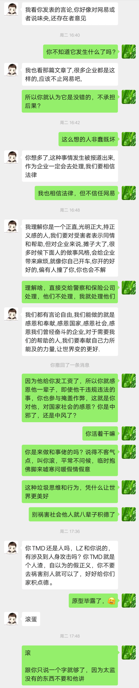

# 平庸之恶，乌合之众

## 缘起

一直到最近，再次触动我的关键因子是2019.11.24号朋友圈热传的一篇文章：  
[网易裁员，让保安把身患绝症的我赶出公司。我在网易亲身经历的噩梦！逼迫、算计、监视、陷害、威胁和暴力裁员手段。](https://mp.weixin.qq.com/s/FW7uR5t6UMMxgkCcAvk-MA) 

转发到朋友圈了，很快前猪场同事王x峰和我联系，这颗同样被裁员割掉的大韭菜，拐弯抹角地歌颂起镰刀来，劝阻我不要转发以上受害人的文章，并教导我要懂得对公司国家社会感恩之情的人生大道理，这些恬不知耻的话把我激怒了。

 

王X峰以前在味央是做猪肉物流发货的，经常对人微微笑，每天工作干点给货物装箱打包的粗活儿，空闲只会胡扯一些隔壁老王或大妈级别的无聊话题，对他其实也不太了解，不知道有其他什么特征能力，当然不知道它还会吃人血馒头。我当时只是觉得这伙计智商或水平可能很一般，所以平常我没什么兴趣主动和它说话，这货突然暴露原形了，还是挺让我诧异的。

发现这些案例，与训狗特别像：

* 主人动一下手指和使个眼色，狗子凶猛扑出去撕咬目标，回来能获得一根骨头的奖励，但是一不小心把人撕咬致残了，主子得赔偿人家，这是前文事件中的”HR，主管和保安“一类；
* 一些狗子被主子丢弃赶出去了，成为外面的流浪狗，感觉外头也没更好地方去，它还主动守在原主子家附近看门护院，看到不顺眼的过来就咬，结果给原主子闯祸了，这是王X峰一类。

其实从动物性而言，这些本来都算是好狗子，可主子并没让把人往死里咬，但为了表现突出而用力过猛，闯祸结果就被锁起来饿饭，被暴打一顿或重新赶出去，这就不好了。

已经过去2年的网易猪场的陈年陋事，在脑子一直如阴沉乌云般氤氲不散，这些事件犹如闪电一样突然击发雷暴雨倾泻而下，我被震醒。

我试图把网易公关描述的“丁爸爸宠爱的女神猪小花”的真容撕开，放在太阳底下晾晒，就不仅仅是说网易养猪造假问题，继而系统总结过往经历，深层次拷问这个集团里的这些小人物，人性何以走到这个地步的？即使这些文字再次被404（全网删帖屏蔽），也要排除困难不遗余力地公布出去，不可再沉默！不能再被遮掩，让以上类似的悲剧不再重演。

如果不是该事件传播，或许我还没有动力再次写网易猪场系列稿子，一方面是懒惰于写字且没有精力分配，还有一个重要原因是回避，不愿意回忆那些不好的历史记录，尤其是普通人的庸庸碌碌的鸡毛蒜皮，就像皮肤上贴着狗皮膏药的暗疮和伤疤一样丑陋不堪，谁愿意经常去揭开看呢？而且，脑子如果想这些阴暗的东西太多，担心是否容易生出脑癌。

看清楚这一切，将对个人成长发展有重大帮助，还是有必要捡起过去尚未清算的旧账，重新盘它一遍。  

## 猪队友是谁？

如以上事件里一再对受害人进行全网404屏蔽删帖并歪曲事实的主管和公关，以及替作恶者出头阻止转发受害者材料的王X峰，作恶还想不被“人身攻击”，不让披露恶行，反而要求名誉？感恩？夸奖 ？……

之所以这么猖獗，归结深层原因，最终发现很多类似事件的背后，执行任务的恶狗及其恶徒主子的家里有不少干活的佣工，帮着恶徒种田做工置办家产赚钱之外，还充当训狗丢骨头吆喝助威的帮凶，支撑了恶狗伤人的一股底气和势力，这是罪恶生存的土壤和环境。

这些佣工或许是“无知或无奈”的帮凶，并没有直接伤人，仅仅做些“小恶”或”小错“，与小善一样都是微不足道的，而且传统观念是“法不责众”，大家觉得”小恶“或”小错“太普遍，历来就被社会容纳和默许的，没有谴责的必要。

扪心自问，雪崩的时候有一片雪花是无辜的吗？每个助纣为虐或保持沉默的人都是非蠢既坏，至少也是平庸之恶，装什么无辜者求同情呢？与之相关的人都要先反思，有没有参与做错了什么。

之前碰到类似的事件，我总以为公司单位大体是好的，只是有个别部门的少数恶劣分子和官僚不作为，随着了解加深和事件演进，逐渐意识到往往集团沉淀下来的渣滓有一大片。

由于都是些庸庸碌碌平凡普通的小人物，平常造作的也是不明显的小恶，关键时刻会经常“拖队伍后腿、出卖队友、坑害队友”，这符合网络上“猪队友”的定义：**“平庸之恶，乌合之众，众生相，猪队友”**，历史总是惊人地相似，让我想起两本书所记录的故事：

[汉娜·阿伦特 Hannah Arendt的《 艾希曼在耶路撒冷：平庸之恶 Eichmann in Jerusalem: A Report of the Banality》](%20https://book.douban.com/subject/26834183/)  
摘选2句经典：

> 1.艾希曼（纳粹战犯）没有对事物进行独立思考和评判的意识和能力；  
> 2.在雪崩的时候，没有一片雪花觉得自己是有责任的，也没有一滴雨会认为自己造成了洪灾；

[古斯塔夫·勒庞 Gustave Le Bon 的《乌合之众 The Crowd: A Study of the Popular Mind》 ](https://book.douban.com/subject/1012611/)  
摘选2句经典：

> 1.当一个人融入群体之中时，他便失去了自我。  
> 2.人一到群体中，智商就严重降低，为了获得认同，个体愿意抛弃是非，用智商去换取那份让人备感安全的归属感。

在更早时候的一起相关事件中，我曾仔细观察过“猪队友”这个群体。

2018.3.15消费者权益保护日，小李同学写了一篇在农场真实见闻的自述“[网红猪小花的故事](https://github.com/li-in/blog/blob/gh-pages/blogarch/wy/pigstory.md)”，我发在知乎，bilibili等社交媒体上，不到半日就被全网404 删帖屏蔽。

很快又收到法务，公关，市场，生产等部门负责人发来的消息，他们受公司上级公务委派。

 

也有一些在公司将近2年也从来都没啥交情（私交淡薄），且一直失联的当年同事们，像惊蛰后的虫子一样突然冒出来，纷纷变成暖心的老大哥了，发来友好善意（虚情假意）的问候。

还有些自愿行为的，可能觉得和我关系还不错，想劝服我，然后就能立功再次回到老大（原主子）身边混口饭吃，没想撞到墙，碰了一鼻子灰，恼怒地原形毕露，例如王X峰。因为都在网易猪场，暂且归类为猪队友，其经典的口气和共同特征总结如下。  

## 猪队友的精神图谱

关心：再现酒局上的情谊，称兄道弟，语重心长地关怀，一切为了我好；

饭碗：公司再不济，也给了我们工资和饭碗，提供发展的空间和平台；

感恩：要带着善意，情怀理想，要先好好做人，懂得感恩之心，要感恩公司，社会，国家；

家庭：来日方长，好好赚钱养家，别整些不能当饭吃的东西，要替家人父母着想，光宗耀祖，为家庭积德；

明理：不要引发舆论和网络暴力，哪家公司没有毛病？整个社会如此，世界上没有完美的事，喝了心灵鸡汤，你要成熟些；

最后：话锋一转语气硬起来，要求主动删除不良影响，停止诋毁，给网易猪小花赔礼道歉，否则后果自负，甚至发来威胁和唾骂，但仅此而已，也没有能力采取更强硬措施。  

## **猪队友的脑路模型**

认知上的错位：本来就是颗韭菜，却自以为是镰刀，还经常歌颂镰刀，嘲笑或痛斥其他韭菜不够鲜嫩；与“一些鸭子往往会旗帜鲜明地捍卫烤鸭店的荣誉”这个笑话有异曲同工之妙；

斯德哥尔摩综合征：精神疾病患者的典型特征，作为一个受害者会拥护加害者，并打压其他受害者和维护其权益的人；

“只计利害不问是非“：自以为是成年人的成熟标志，喜欢教导其他人遵守这个游戏规则，并拉其他人下水；

高情商：认为情商比智商，知识比能力更重要，高情商是一种善意、情怀和美德；

更丰富的用户画像，有待总结 updating ……

