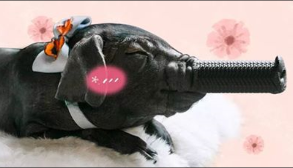
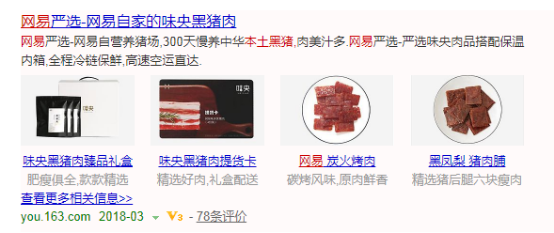
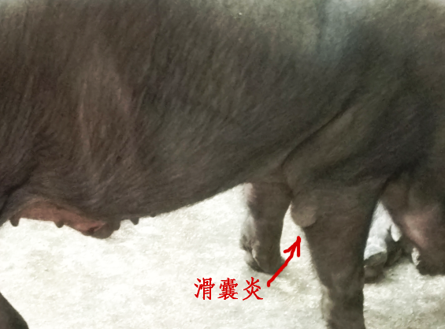
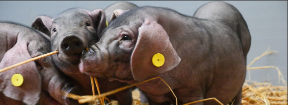
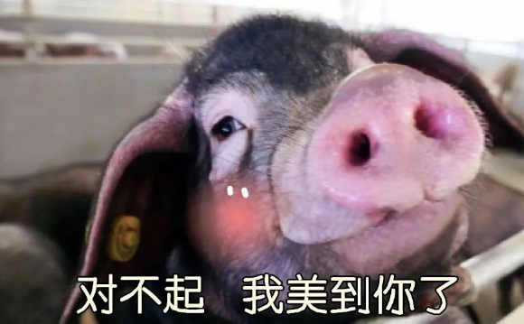
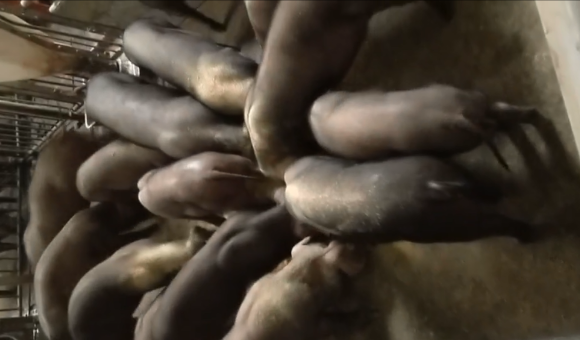
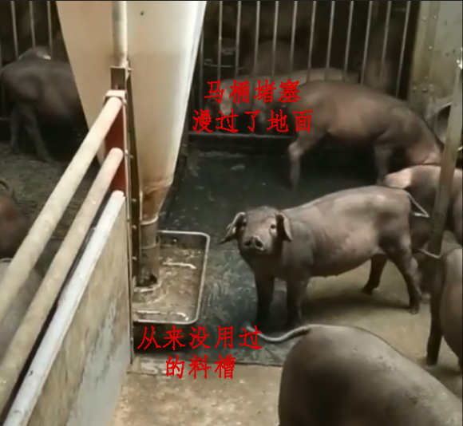
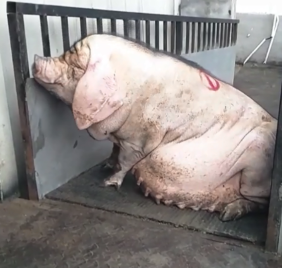
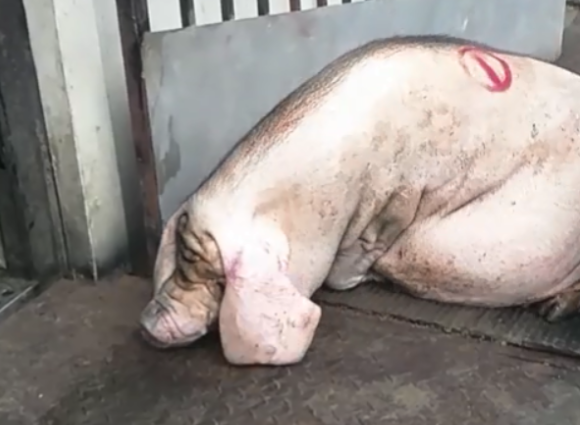
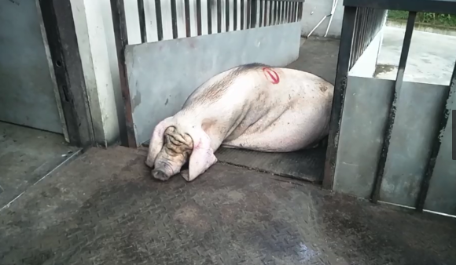

# 网红猪小花的故事

作者：小李    发布于 2018-03-14

## 来自网易离职员工的自述

我是2013届动物科学硕士，毕业于华南农业大学动物科学学院动物生理生化实验室。在校期间主要从事与中国传统品种猪的肌内脂肪沉积与其基因多样性相关的研究。 也参与过实验室其他方面的研究，比如如何给养殖业节氮减排，比如养殖场猪的行为学研究。 也参与过一些动物福利方面的探索，比如调查国内农场动物的福利现状，比如声音、气味等因素对猪行为的影响。

因此，我了解国内现阶段工厂化养殖的存在的一些弊病：

* 低福利的饲养环境给动物本身或肉质造成的影响；
* 能源消耗，饲料消耗，排污排废等给社会和环境带来的负担；
* 低成本的饲料原料多为进口的玉米和大豆，而我国这两种粮食的对外依赖性在逐年升高；
* 大规模工厂化养殖是一个高投入、高风险的行业，因此会普遍使用抗生素作为动物保健品，以期将风险降至最低；
* 为了追求高效益，通常采用西方品种的配套系，而国内丰富的地方品种猪资源正在缩水…

高中毕业之时，正值国内食品安全问题频出之时，因此我很坚定地选择了农业院校，希望可以在生产端做些事情。

后来发现养殖业不光涉及食品安全，还与生态、环境密切相关。

因此，当听说“网易”这家有态度的互联网公司也涉足了养殖业时，我的内心是充满敬佩的。

网易的163.com大概是我童年时期第一个能脱口而出的域名吧，在我玩过的不少的国产游戏中，我对“梦幻西游”专情了十几年，也曾经喜欢消费严选的产品。 曾经我对网易的印象是：有责任感、有价值观、网易出品必属精品。

2016年11月开始持续半年时间里，我有幸作为志愿者参与了网易公开课平台的动物福利相关的翻译工作。 当时感觉，网易花了7年的时间进行养殖探索是值得的，重要的不仅仅是高质量产品本身，更是其输出的价值观对社会的影响，比如对消费行为的影响，对教学和科研方向的影响，对其他同行的决策的影响……

2017年6月大学毕业，我来到传说中的网易（味央）养猪场工作，开心的同时，也感受到困难重重，发现网易塑造的现象级网红猪小花的宣传报道与实际情况相距甚远。

## 虚假浮夸的宣传

**“猪公寓”、“蹲马桶”、“听音乐”、“猪厨房”、“猪空调”、“不打针、不吃药”、“7年”、“6个人、2万头”、“高水准动物福利”、“网易自营养猪场”、“中华本土黑猪”** …

**网易味央2017年3月28日的直播:**

* [网易猪场公开，丁磊对话吴晓波](http://c.m.163.com/news/l/120854.html?w=7)

**网易味央的部分公众号文章:**

* [别不信，你的人生也许不如这头猪](https://mp.weixin.qq.com/s?__biz=MzI4MDE2MjIxMg==&mid=2650755972&idx=1&sn=a7d175a2a62ed7767750e1665992c608&chksm=f3b7494fc4c0c059c3b9543843192618eee26c60d0536253517b3e56d3feada138200c40e42d&mpshare=1&scene=1&srcid=0227FC4EUIMGzu87SXqNPpvg#rd)
* [领导：这有一份现象级猪肉的年终总结等待您的检阅](https://mp.weixin.qq.com/s?__biz=MzI4MDE2MjIxMg==&mid=2650755792&idx=1&sn=59a35d72681dde3e3428c7de3b6af022&chksm=f3b7481bc4c0c10d17250f20541cd1e0ade2ff148884f525de5872455f124aa26b8aa6e5307b&mpshare=1&scene=1&srcid=0227ehapvVU4qBFjt0o4mS3b#rd)
* [网易养猪7年的光荣与梦想都在这了](https://zhuanlan.zhihu.com/p/25747948)

## 现实中的猪小花

### **“慢养300天”“2万头”“中华本土黑猪”“网易自营养猪场”**

首先，安吉的味央猪场为两点式布局，分为种猪区和商品猪区。

实际农场的设计使得种猪区可容纳母猪约1000头，年产仔猪勉强达到2万头。但是，在该规模下“谷饲慢养300天”10个月的目标拉长了生产周期，使下游囤积更多的商品猪，所需的商品猪存栏量将达到1.7万头。不幸的是，味央猪场的商品猪区，在密度合理的情况下，**实际存栏量小于6000头，出栏量小于7000头/年。**

**为了达到年出栏2万头的目标，有以下几种方法：**

* **引入洋公猪品种以缩短饲养周期。** 2017年3月丁磊在直播视频中介绍了一种生长速度很快的洋猪就叫杜洛克，并说中国土猪味道好且需要得到保护，给大家的印象就是养洋猪是不好的，养本土黑猪更好，给公众传达的意思是我们养的是纯正本土黑猪，然而6月之后就引进纯种杜洛克作为种公猪，淘汰了几乎所有的本土种公猪；

* **增加饲养密度** 饲养密度变为极限的15~20头/圈，高密度养殖导致了恶劣的饲养环境，“不打针”、“不吃药”、“动物福利”是不可能的；
* 即使这样，也装不下那么多商品猪，最后只能在江苏某地**找养殖场代养**。网易宣称年产2万头，实际自营产能小于7000头/年，超过6成猪代养的也算“网易自营养猪场”吗？代养部分的饲养环境能否达到“味央的公寓级标准”呢？网易至今也没有公布。

在台湾养猪大王参观猪场的网易形象宣传片中，养猪大王夸我们的饲养密度小，空间大。要知道那个时候才3月份，农场养的猪可能真的很少。我2017年6月刚到农场的时候，所有母猪加起来不到700头，保育和育肥约12头/圈（对于味央的栏圈而言是一个合理的密度），还好多空栏。

然而，正如上述的设计与目标的不配套，很快，商品猪区就爆满了，我们开始向外面转移保育猪让别的养殖场代养。我参与了其中几次转猪，分别于7月25日凌晨、8月9-10日的夜晚和9月9日的夜晚分别向外转移了300多头、500多头和约450头保育猪。

说起猪群的转移，由于缺少合理的走猪道和出猪台，无论是场内的猪群转移还是对外转移，转猪现场都极为狼狈，更别提动物福利标准了。

### **“猪马桶”**

“猪马桶”其实就是业内常见的漏缝地板加上网易自创的漏斗，收集的粪污通过地下管道被粪污收集中心处理。他们自创的漏斗设计有缺陷，落进马桶的排泄物通常不能被即时冲走，堆积在漏缝下面，还会时常堵塞，加上饲养密度日益增大，舍内氨气味很浓。

另一方面，在直播中会看到我们给猪添加稻草玩具，地上也会铺上厚厚的稻草垫料（对猪而言，这是相当重要的福利标志），**然而我们的“猪马桶”由于很容易堵塞，所以实际生产中是不会提供稻草的**。我们的猪和其他普通的工厂化养殖的猪一样，生活在并不适合猪的水泥地板上，**易造成疝气和滑囊炎**。

  

甚至其他猪场的“猪马桶”（漏缝地板）更容易把粪污冲走，不会让猪舍又臭又脏。在直播中可以看到猪舍所有的门窗都是紧闭的，原因之一是为了不让猪舍内的臭气逸出被来访者察觉。尽管每次来访客前，都会打扫卫生并喷洒可以遮掩臭味的制剂，我们依然会担心臭气外逸。直播的那次，养的猪少且天气凉爽，没发现有问题。但是后来某次，大概是9月份，有接连几次外宾来访，在高温高湿的情况下关窗，导致猪只死亡率暴增。

另外，我相信经过处理的污水可以达到排放标准，但不相信可以达到饮用水标准，另外一位知悉的同事将提供佐证。

### **“猪厨房、国际领先”**

“猪厨房”其实是就自动饲喂系统，这个在国内的确算是比较先进的，特别是液态料饲喂。问题是，**安吉的味央农场虽然拥有国际领先设备，却无法实现自动喂料**。

安吉的味央“猪厨房”大概有三套：

* 育肥舍的是一套荷兰的液态料饲喂系统，经过一次拆迁异地安装，存在部分零部件损坏，管道安装不合理等问题，一直处于瘫痪状态，所以两千多头育肥猪长期全靠人工投喂。
* 保育舍是一套普通的固态料投喂系统，但是存储饲料的大料塔是不完善的，所以不能自动送料，即使人工将料投进每个栏位的小料塔里，也会担心自由采食造成的仔猪拉稀，所以保育舍的三千多头猪也靠人工喂料。
* 母猪区的近一千头母猪配备的是一套比较新的德国液态料系统，但是由于怀孕母猪的个体差异和不同阶段的采食量的差异，安吉的味央农场在员工没有熟练掌握操作系统且管理水平不稳定的情况下是很难实现自动饲喂的，仅有少数的空怀母猪在用这套设备。

在直播中，杨老师也高度评价了我们采用的先进的喂料技术，但是他恐怕不知道我们拥有设备却派不上用场吧。

更糟糕的是，在自动喂料管线瘫痪的情况下，没有和水的粉状饲料会让饲养环境变得更加恶劣，饲养员和猪每天都在经历粉尘，这算pm2.5-10污染吗？

### **“40元伙食费”**

此外，直播中说猪吃的饲料是40元/只/天（脚趾头也能想出来这不可能，因为如此计算每斤猪肉的饲料成本就至少80元）。还说，吃的除了玉米豆粕这些常规的猪饲料，还有豆腐渣、酒糟，直播画面和公众号的照片上也能看到厚厚的稻草上滚落一些像叶菜、板栗和番薯之类的食物。

然而实际上并没有豆腐渣、酒糟、叶菜、板栗和番薯，保育猪吃的是外购的教槽料和保育料，公猪吃的是外购的公猪料，其他猪的基本口粮只有自己打粉混合的粉状饲料，原料仅有玉米、豆粕、麸皮、米糠，再根据不同阶段添加不同的预混料，非常普通。可以根据采食量和饲料价格算出每只猪每天的口粮费。

网易食堂的员工餐也达不到每人每天40元吧，怎么可能猪比人吃得好呢？

这和其他工厂化养殖场提供的饲料没有太大差别，唯一值得肯定的是，他们选用了不含抗生素的饲料原料。但光靠这一点就想收割顾客们的智商税了么，下文会继续说明他们如何让“不打针不吃药”也成为泡影。

### **“猪公寓”“猪空调”，“不打针、不吃药”，“高福利养殖”**

“猪空调”的设计也是有缺陷的，位置装得有点高，通风量太小，夏天根本派不上用场，还成为用电高峰期的累赘，所以即使夏天也很少开启。我在农场任职的这个夏天，成批的猪躺在地上喘气。为了保障猪的性命，不得不给猪舍拉上遮阳网，所以直播里说的6米一个的“阳光板”也是被遮住的，猪舍内昏暗、湿热。

这种“高大上”的“猪公寓”的环境下，猪容易生病，不得不在原本无抗生素的饲料中加点扶本康、替米考星之类抗生素做做保健了，严重的还要额外打针吃药，常见的有阿莫西林、链霉素、卡那霉素、林可霉素等。每天大概有10%育肥猪需要打针吃药，产房的分娩母猪也经常需要很多针药剂。其实合理的医疗保健在高福利养殖中是被允许的，只需要严格遵守执业兽医的指导即可，我们大可不必标榜“不打针”、“不吃药”，对公众坦诚很重要。

“高福利养殖”很重要的一点是减少限位栏的使用。然而，由于配种舍的自动电子投喂器的大小并不适合安吉的味央农场饲养的二花脸（品种）母猪，只能当做限位栏使用了。电子投喂器设计的初衷是为了防止母猪抢食，当一头母猪进入一个投喂栏后，为了防止后面的母猪争抢，它身后的门会自动关上，吃完后母猪后退时会用臀部把门推开。

因为二花脸母猪的体型小、力气小，且很多患有腿疾，学不会这一系列动作，所以只好被关在限位栏里了，这是不合理的设计导致的。更糟糕的是，由于规模的扩大，后备母猪只能占用怀孕母猪的怀孕舍（非限位栏），而怀孕母猪却要在配种舍的“限位栏”待上更长的时间。

于是，母猪在大约每5个月一轮的生产周期中有3个多月的时间都几乎无法动弹。而养在怀孕舍的后备母猪由于个头小而喝不到饮水器的水（怀孕舍饮水器设计的高度只适合成年母猪），增加人工喂水的工作量。低福利养殖条件下，“不打针”、“不吃药”是不可能的。

### **“听音乐”**

人们都以为味央的猪都是“听音乐”长大的，甚至得知我在一线工作的网易同事也会拿这件事询问我，我只能说它们听过音乐。然而，其实只有访客来临时才会放音乐，真实的养猪现场只能听到猪嚎叫的噪音。

### **“开心”**

丁磊说“除了要被吃掉，在网易当一头猪，可能比熊猫还开心”。实际上，“限位栏”的母猪能开心吗，最后路都不会走了，只是生仔的机器。空间少，无垫料，无所事事，小猪们的日常是相当无聊的，于是相互打架、顶肚子、咬尾。保育舍的小猪患上氙气和皮肤病的比例从六月份到十月份一直在上升。下图分别展示了沉溺于自我想象中的“猪小花”和现实中的“猪小花”。

**沉溺于自我想象中的猪小花**

**现实中的猪小花**

摄于2017年10月的保育舍，因下游的商品猪舍挤爆了，上游已经长大的猪小花只好继续挤在保育舍，保育栏对它们来说已经太小了，环境变得非常恶劣：

 

摄于2017年8月, 因长期缺乏运动，营养跟不上，地面条件差，猪走道设计不合理等因素，这只即将分娩的母猪无法站立：

  

### **“2万头，6个人掌控全场”**

杨老师可能并没有看到设备的运行情况，所以他以为网易味央是先进养殖设备的“集大成者”，他可能没想到这不过是一套堆砌组装的“模型”供人参观瞻仰罢了。所以，一个几乎全手动的万头猪场（实际达不到万头，猪舍规模决定了猪群大小，就算挤爆了也就7000头左右）光靠“6个人”当然是无法正常运营的。

仅安吉的农场里就有至少3名常驻的管理人员，为解决这样那样的问题或者是改进各种不合理的设计而焦头烂额。配种舍、怀孕舍、分娩舍、公猪站、保育舍、育肥舍每个舍都需要1-2名技术员和1-3名饲养员。仅生活工作在安吉猪场里与养猪生产直接相关的工作人员就有20多人。

此外，在杭州网易大厦的办公室里，还有许多财务、研发、营销、设计等人员，**这一部分人绝大多数都不了解真实的农场，正如直播开头提到的，他们自己都很好奇他们的猪是不是听音乐长大的，正是这样的一群人包装出了猪小花的形象**。直播中后来出现一名穿着制服的男子，大家以为是场里的技术人员，实际上是常年在网易大厦的负责农业市场部的营销和品牌形象的鹿某。只有常年在一线工作的人知道现场工作有多么不容易，甚至有农场人员觉得这很不公平：拿着差不多的工资，有些人坐在网易大厦，而一些人却在生产一线焦头烂额；对那些做着最脏最累的活，月入却只有三四千的饲养员也非常不公平（有电话录音待公布）。

### “7年”的答卷

这是网易养猪“7年”上交的答卷，我内心有些忧虑。养殖业确实是一个难度很大的行业，高福利养殖对养殖场的设计有非常高的要求，在国内也是非常新的理念，我佩服网易的勇气，也理解味央的处境。

我钦佩网易为新一代养殖模式作出的探索和努力，我也相信只要用心做，那些目标对网易而言都不是难事。**但是，让消费者（包括一部分以众筹形式参与的消费者）以为自己的钱被用于高水平养猪，实际上却花在了一堆派不上用场的硬件和浮夸的营销上，同行表面上夸你，暗地里可能是嘲笑**。

这真的是网易的作风吗，还是被舆论绑架了，或者是被自己标榜的宣传绑架了。

## 附言

后来（大概在社会摸爬滚打了一两年后吧），笔者悟出了**其本质是镰刀割韭菜的游戏。无论是投资人、劳动者、消费者，甚至是旁观者，都是镰刀挥舞的对象。镰刀之所以存在，就是因为有太多的“猪队友“。**

